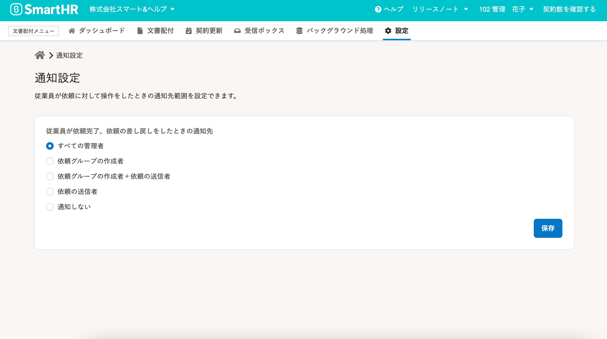
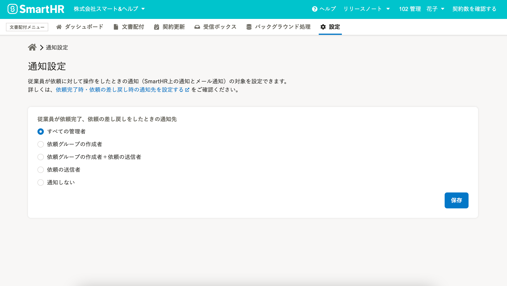
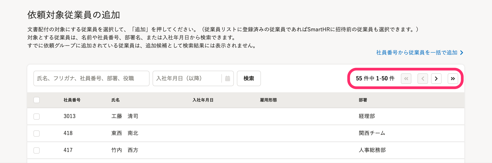
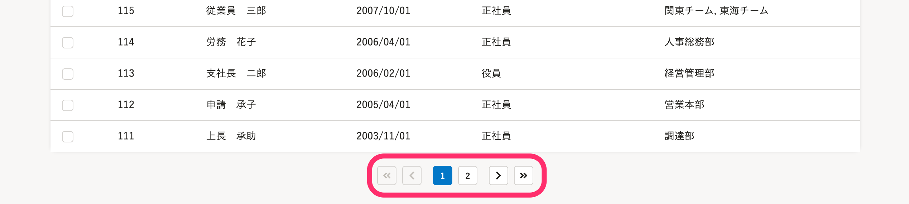

2021年10月12日（火）に行なったアップデートの詳細をお知らせします。

文書配付機能の変更点は、カイゼン2件でした。

# 📈 カイゼン

## 通知設定画面の説明をわかりやすくしました

通知設定画面の説明文を変更し、関連するヘルプページへのリンクを追加しました。

メールとSmartHR上の通知設定であることを明記しています。

| 変更前 | 変更後 |
| --- | --- |
|  |  |

:::related
[依頼完了時・依頼の差し戻し時の通知先を設定する](https://knowledge.smarthr.jp/hc/ja/articles/4407530909593)
:::

## 依頼対象従業員の追加画面の一覧に、表示件数を表示するようにしました

依頼対象従業員の追加画面の一覧の右上に、表示件数とページを移動できるボタンを追加しました。

検索した場合に該当件数を把握できるようにし、表示が51件以上の場合は画面下までスクロールしなくてもページ送りできるようにしました。

また、一覧下部にあるページ送りのボタンのデザインをSmartHR全体のデザインにあわせて変更しました。

