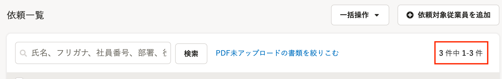
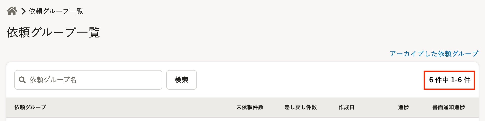

2021年10月13日（水）に行なったアップデートの詳細をお知らせします。

文書配付機能の変更点は、カイゼン1件・不具合修正1件でした。

# 📈 カイゼン

## 一覧画面が1ページ以下の場合も一覧に件数を表示するようにしました

これまでは、一覧の表示が1ページ以下に収まる場合には件数を表示していませんでしたが、SmartHR全体の挙動に合わせて、必ず表示するように変更しました。

対象画面は下記のとおりです。

依頼グループ詳細の下書きタブの **［依頼一覧］** 

 **［依頼グループ一覧］** 

# 👨‍⚕️ 不具合修正

書類テンプレート名に関する1件の不具合修正を行ないました。
