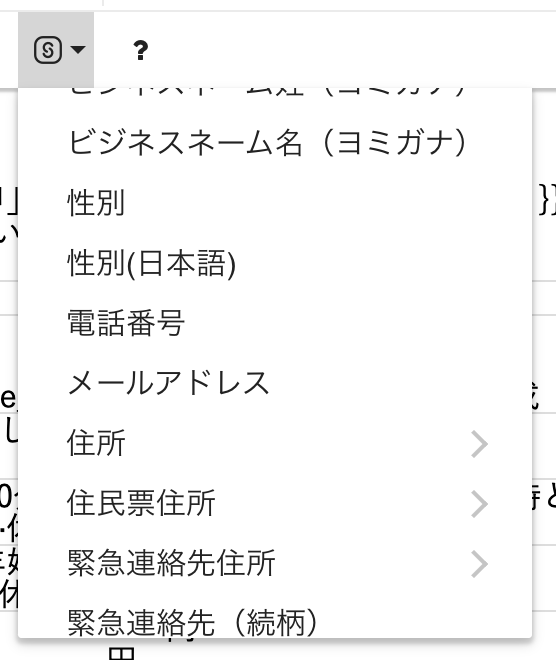
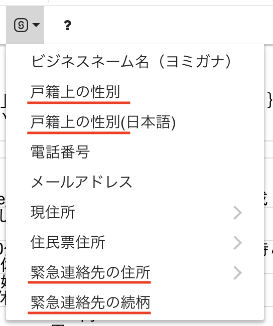

2021年10月18日（月）に行なったアップデートの詳細をお知らせします。

文書配付機能の変更点は、カイゼン1件でした。

# 📈 カイゼン

## 書類テンプレートに挿入できるSmartHRの従業員情報の項目名を変更しました

書類テンプレートに挿入できるSmartHRの従業員情報の項目名を変更しました。

SmartHR基本機能の従業員情報の項目名変更にあわせた対応です。

変更例

- 性別 → 戸籍上の性別
- 入社日 → 入社年月日
- 退職理由 → 退職事由
- 定期券代① → 通勤手当1の定期券代
- 緊急連絡先住所 → 緊急連絡先の住所　など

| 変更前 | 変更後 |
| --- | --- |
|  |  |

:::related
[SmartHRの従業員項目を書類テンプレートに挿入する](https://knowledge.smarthr.jp/hc/ja/articles/360036818773)
:::
