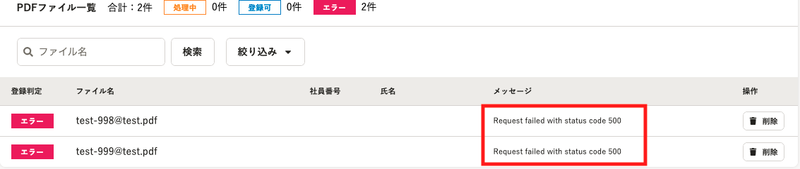
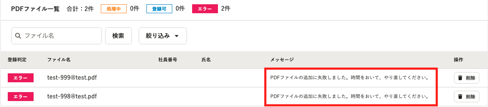

2021年10月19日（火）に行なったアップデートの詳細をお知らせします。

文書配付機能の変更点は、カイゼン1件でした。

# 📈 カイゼン

## 別々のPDFファイル一括アップロードで、ファイル追加が失敗した場合に表示されるエラーメッセージを変更しました

これまで、別々のPDFファイル一括アップロードで、ファイル追加が失敗すると、英語でエラーメッセージが表示されていました。

今回の改修により、エラー内容と対処方法を日本語で表示し、よりわかりやすいメッセージに変更しました。

| 変更前 |  |
| --- | --- |
| 変更後 |  |
