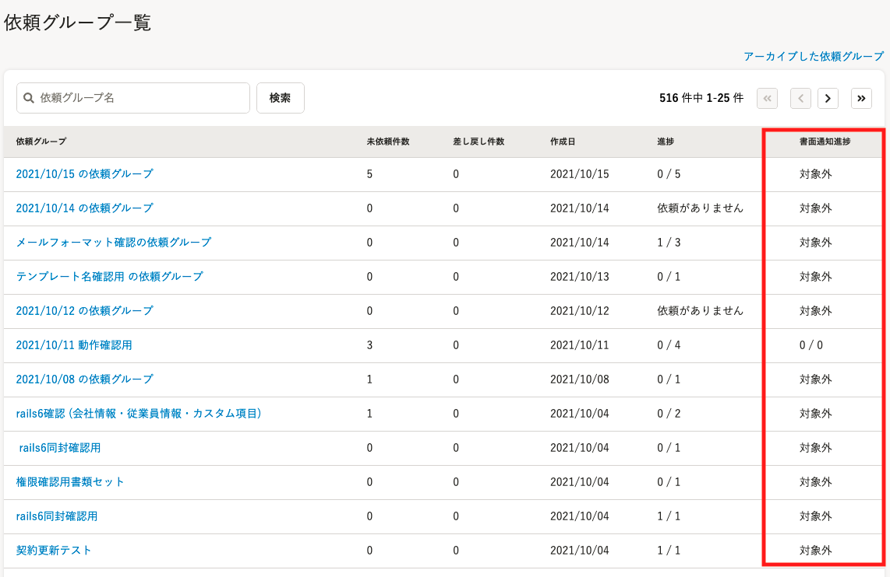
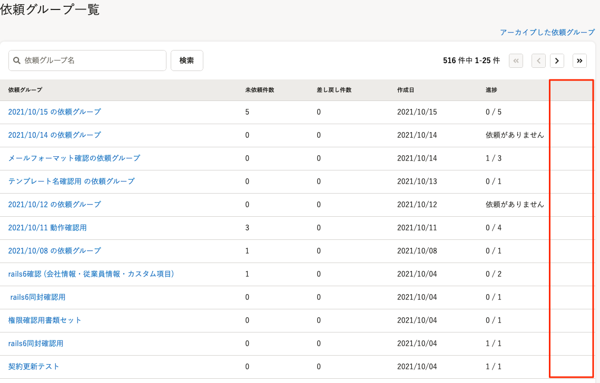
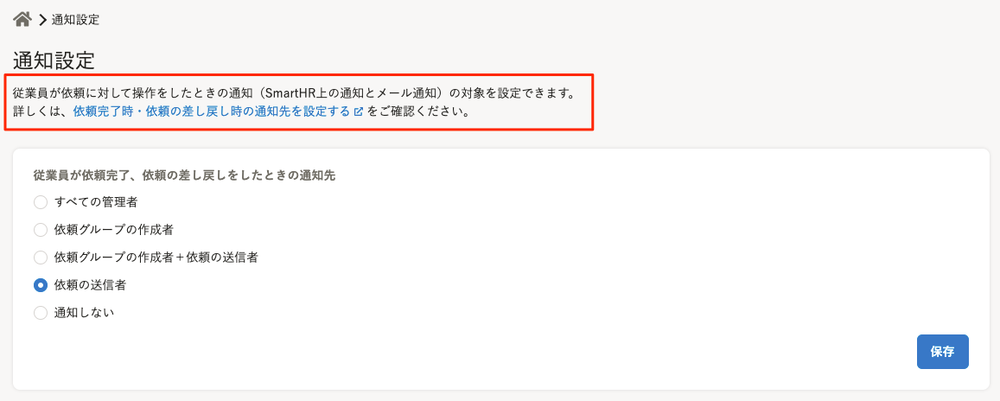
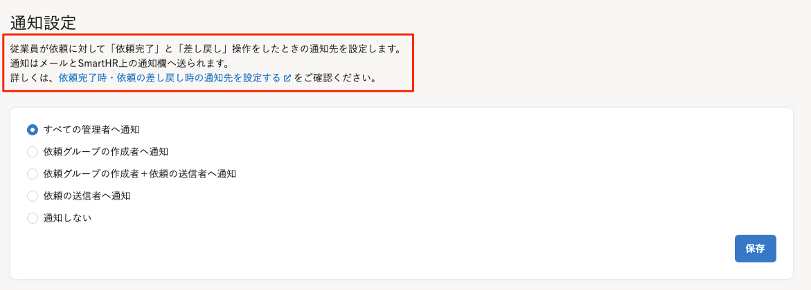

2021年10月20日（水）に行なったアップデートの詳細をお知らせします。

文書配付機能の変更点は、カイゼン2件でした。

# 📈 カイゼン

## 依頼グループ一覧画面の「書面通知進捗」欄を非表示にしました

これまで、依頼グループ一覧画面に「書面通知進捗」欄が表示されていましたが、依頼グループ一覧画面の表示速度を改善するため非表示にしました。

| 変更前 |  |
| --- | --- |
| 変更後 |  |

今後、書面通知進捗を管理する場合は、依頼一覧画面の「書面通知」欄か、各依頼のプレビュー画面にある「書面での通知管理」機能をご活用ください。

## 通知設定画面の説明文を変更しました

通知設定画面の説明文について、具体的にどのような操作を行なった場合に通知されるのかを明示した内容に変更しました。

| 変更前 |  |
| --- | --- |
| 変更後 |  |
