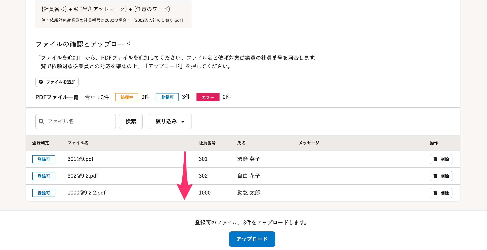

2021年10月21日（木）に行なったアップデートの詳細をお知らせします。

文書配付機能の変更点は、カイゼン1件・不具合修正1件でした。

# 📈 カイゼン

## 別々のPDFファイル一括アップロードのページを表示した際の、ファイルの並び順を変更しました

これまでは、別々のPDFファイル一括アップロード画面を表示した場合、ファイルの登録判定が **［登録可］** のファイルは、並び順がランダムで表示されていました。

今回の改修により、 **［登録可］** のファイルは、社員番号の昇順で並ぶようにしました。

なお、PDFファイルを追加した場合は、追加した順番にファイルが並びます。

# 👨‍⚕️ 不具合修正

依頼グループの編集画面中の説明において、設定名の表記に一部誤りがあったため修正を行ないました。
