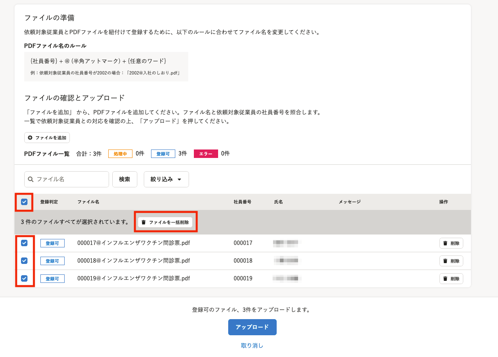
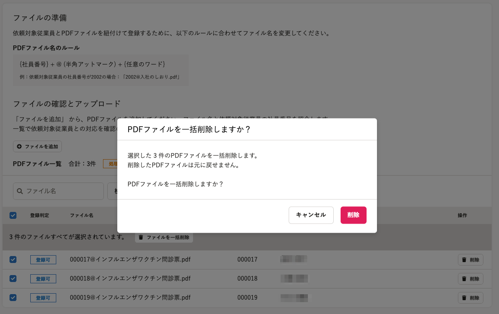

2021年10月26日（火）に行なったアップデートの詳細をお知らせします。

文書配付機能の変更点は、カイゼン1件でした。

# 📈 カイゼン

## 別々のPDFファイル一括アップロードで追加したファイルを、一括で削除できるようにしました

これまで、別々のPDFファイル一括アップロードで追加したファイルを削除したい場合、ファイルごとに削除操作を行なう必要がありました。

今回の改修により、複数のPDFファイルを一括して削除できるようになりました。

PDFファイルの一括チェックもしくは、削除したいPDFファイルをチェックした後に、 **［ファイルを一括削除］** を押すと、ダイアログが表示されます。

 **［削除］** を押すと、該当のPDFファイルが一覧から削除されます。

