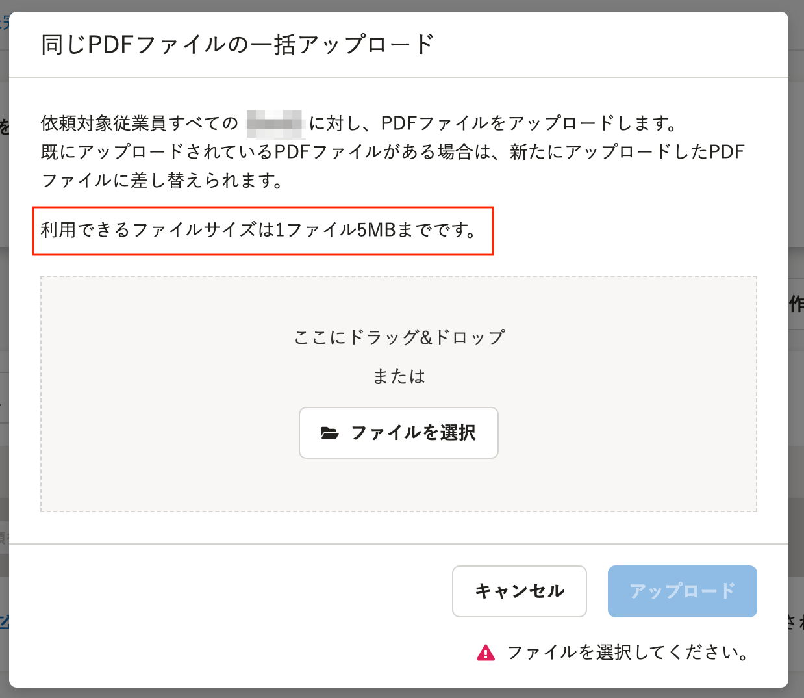

2021年10月29日（金）に行なったアップデートの詳細をお知らせします。

文書配付機能の変更点は、カイゼン1件でした。

# 📈 カイゼン

## ［同じPDFファイルの一括アップロード］画面と、個別の［PDFファイルのアップロード］画面のダイアログに、利用できる1ファイルあたりの最大ファイルサイズを明記しました

これまで、［別々のPDFファイル一括アップロード］画面のダイアログには、利用できる1ファイルあたりの最大ファイルサイズについて明記していましたが、［同じPDFファイルの一括アップロード］画面のダイアログと、個別の［PDFファイルのアップロード］画面のダイアログには明記していませんでした。

今回、それぞれのダイアログに、利用できるファイルサイズは1ファイル5MBまでであることを明記しました。

**同じPDFファイルの一括アップロード画面の文言追加箇所**

**個別のPDFファイルの一括アップロード画面の文言追加箇所**

