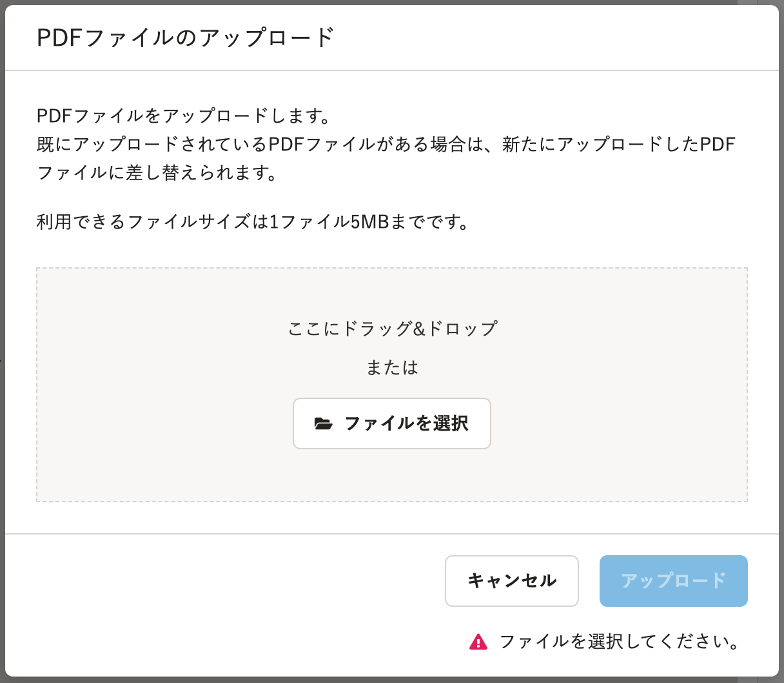
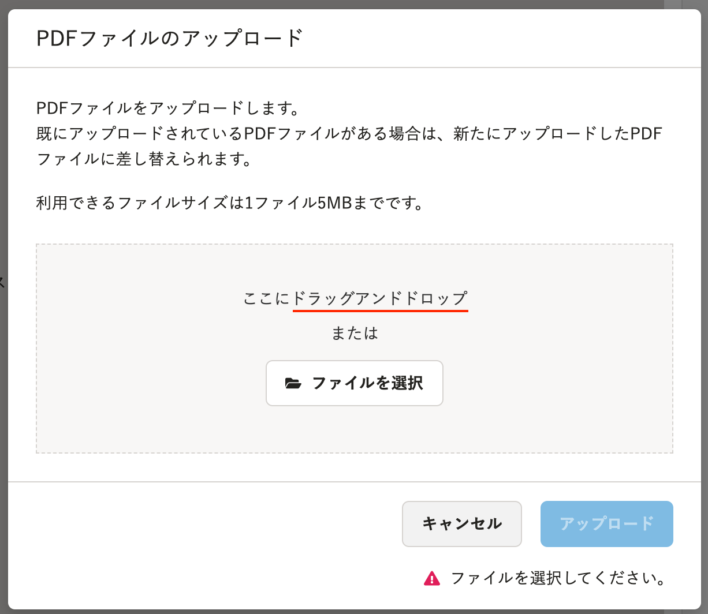

2021年11月1日（月）に行なったアップデートの詳細をお知らせします。

文書配付機能の変更点は、カイゼン1件でした。

# 📈 カイゼン

## PDFファイルアップロード画面の文言を変更しました

SmartHR全体の表記ルールに合わせて、アップロード対象のPDFファイルを選択するダイアログ内の文言を **［ドラッグ&ドロップ］** から **［ドラッグアンドドロップ］** に変更しました。

対象画面は下記のとおりです。

- 書類詳細画面の **［PDFファイルのアップロード］** 画面
- 依頼グループ詳細画面の **［同じPDFファイルの一括アップロード］** 画面
- 別々のPDFファイルを一括アップロード画面で、 **［ファイルを追加］** をクリックして表示される **［PDFファイルの追加］** 画面

**変更前・変更後の画面例**

| **変更前** | **変更後** |
| --- | --- |
|  |  |
