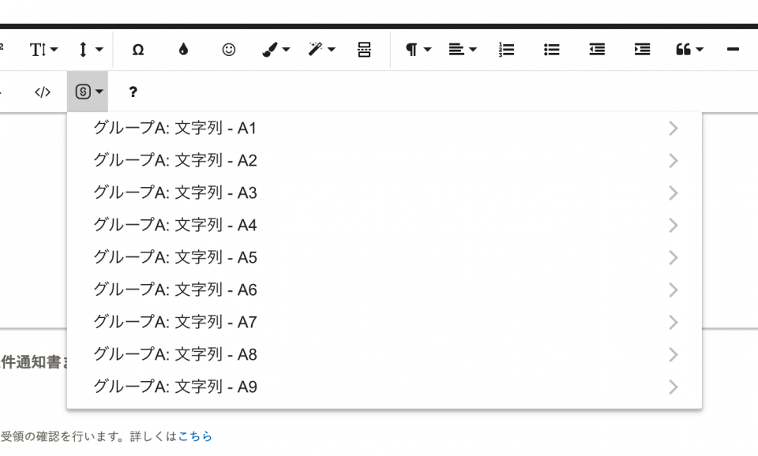

2021年11月10日（水）に行なったアップデートの詳細をお知らせします。

文書配付機能の変更点は、カイゼン2件でした。

# 📈 カイゼン

## 書類テンプレート作成画面の表示速度をカイゼンしました

これまでカスタム従業員項目を多く使用している場合、書類テンプレート作成画面の表示時間が遅くなることがありました。

今回の改修で内部処理を見直し、表示速度をカイゼンしました。

## 書類テンプレート作成画面内で表示する、SmartHRのカスタム従業員項目の並び順を変更を行いました

これまで書類テンプレート作成画面内でSmartHRの **［カスタム従業員項目］** を表示した際に、項目の並び順が不規則でした。

今回の改修で、SmartHRの **［カスタム従業員項目］** の「カスタム項目一覧」と同じ並び順で表示されるように変更しました。

| **変更前** | **変更後** |
| --- | --- |
|  |  |
