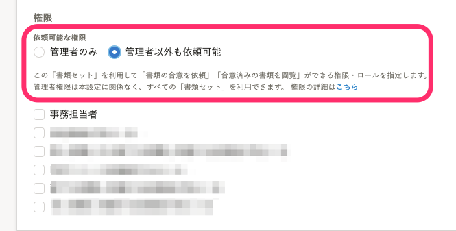
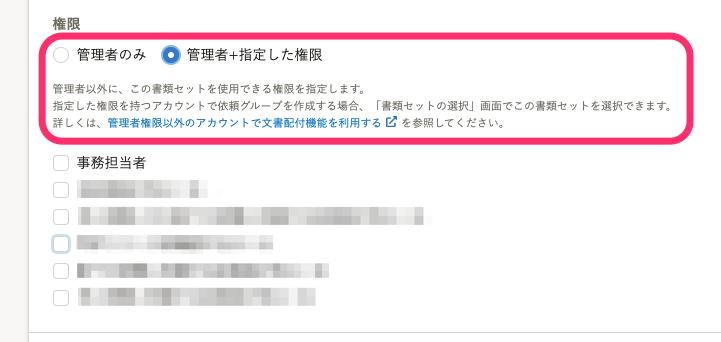

2021年11月17日（水）に行なったアップデートの詳細をお知らせします。

文書配付機能の変更点は、改善2件・不具合修正1件でした。

# 📈 改善

## 依頼グループ詳細画面で大量の依頼を一括送信した場合の処理速度を改善しました

今回の改修で内部処理を見直し、依頼グループ詳細画面で大量の依頼を一括送信した場合の処理速度を改善しました。

## 書類セットの作成・編集画面の［権限］項目の文言を変更しました

書類セットの作成・編集画面の **［権限］** 項目の文言を、よりわかりやすい内容に見直しました。

| **変更前** | **変更後** |
| --- | --- |
|  |  |

# 👨‍⚕️ 不具合修正

依頼グループに依頼対象従業員を追加する際の、従業員一括選択機能に関する不具合を修正しました。
