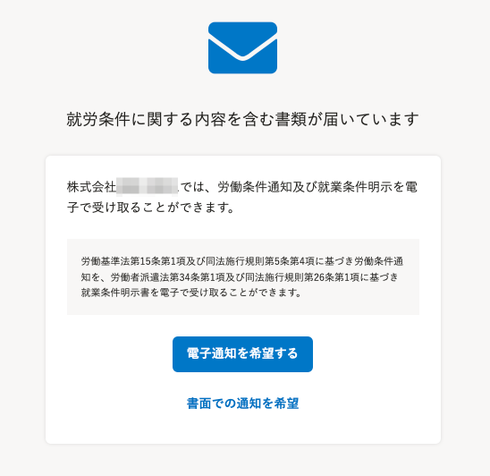
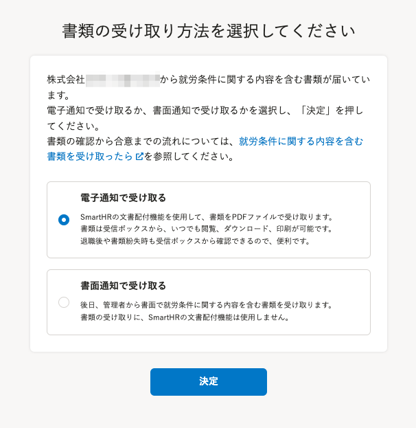

2021年12月1日（水）に行なったアップデートの詳細をお知らせします。

文書配付機能の変更点は、改善1件・不具合修正1件でした。

# 📈 改善

## 就労条件に関する内容を含む書類の受け取り方法を選択する画面を改善しました

従来の、就労条件に関する内容を含む書類の受け取り方法を選択する画面では、電子通知と書面通知にどのような違いがあるのか、従業員にとってわかりにくい説明文になっていました。

今回の改修で文言とレイアウトを見直し、よりわかりやすい画面に改善しました。

| **変更前** | **変更後** |
| --- | --- |
|  |      |

# 👨‍⚕️ 不具合修正

カスタム従業員項目のグループ名に、半角の「/」を使用した場合の不具合を修正しました。
