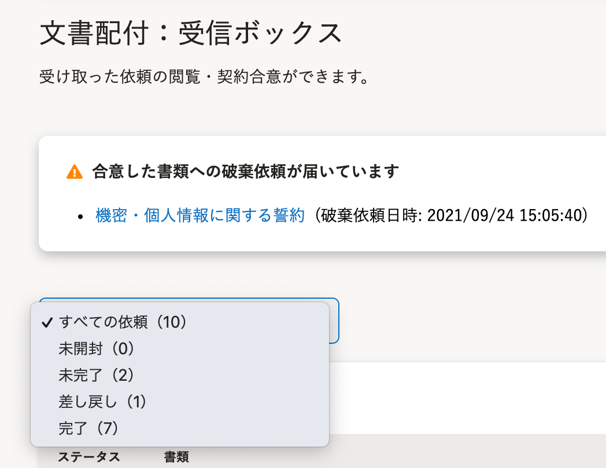
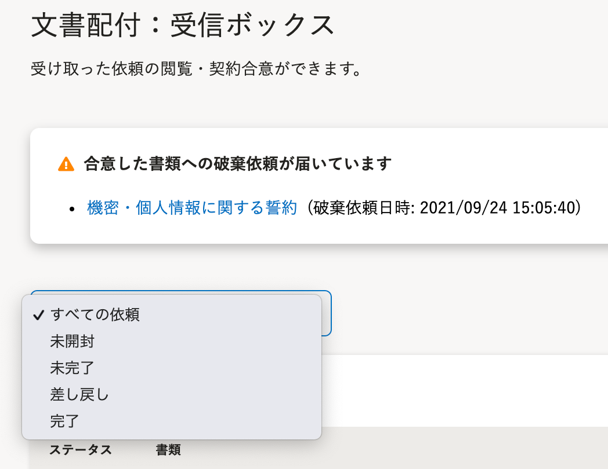

2021年12月7日（火）に行なったアップデートの詳細をお知らせします。

文書配付機能の変更点は、改善1件でした。

# 📈 改善

## 受信ボックスの［すべての依頼］の各ステータス件数を非表示にしました

受信ボックスにある、 **［すべての依頼］** の各ステータス件数を非表示にしました。

受信ボックス画面へアクセスが集中した際の、データベースへの負荷を軽減するための対応です。

| 変更前 | 変更後 |
| --- | --- |
|  |  |
