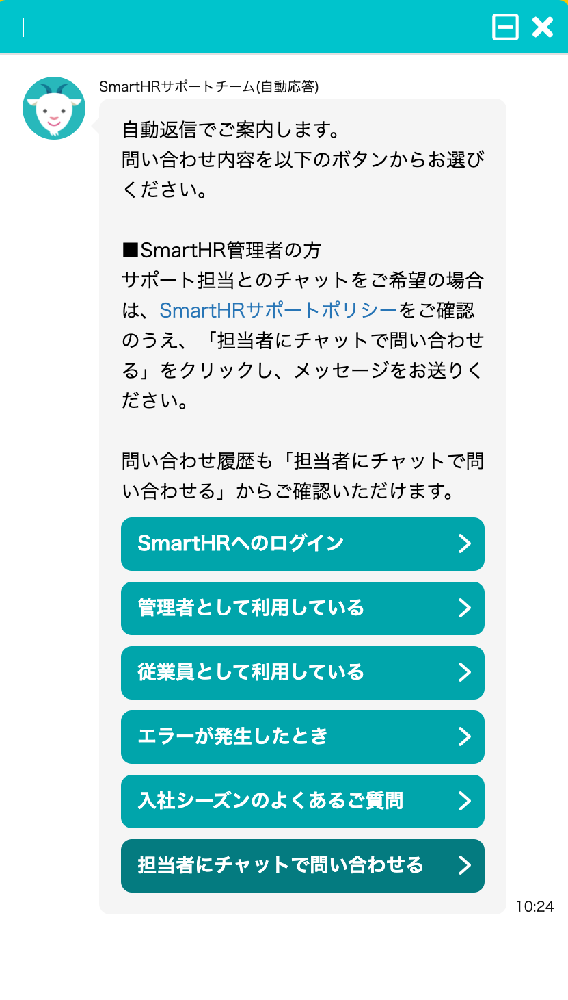

2021年12月9日（木）に行なったアップデートの詳細をお知らせします。

文書配付機能の変更点は、改善1件でした。

# 📈 改善

## チャットボットの仕組みを変更しました

これまで提供していたチャットボットは、チャットボットを開き、該当するお問い合わせをクリックしていくことで回答が表示される「シナリオ型」の仕様でした。

今回の変更で、メッセージ入力欄にお問い合わせ内容を入力することで、回答が直接表示される「AI型」になりました。

すでに、SmartHRの基本機能と年末調整機能に導入していましたが、今回のリリースにより、文書配付機能でも利用できるようになりました。

:::related
[文書配付機能に表示しているチャットボットの仕組みを変更します](https://smarthr.jp/news/30852)
:::

**アイコン**

| 変更前 | 変更後 |
| --- | --- |
|  |  |

**アイコンクリック後の表示**

| 変更前 | 変更後 |
| --- | --- |
|  |  |
