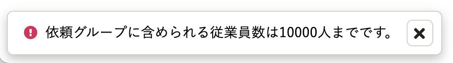
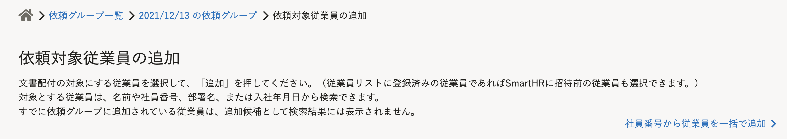
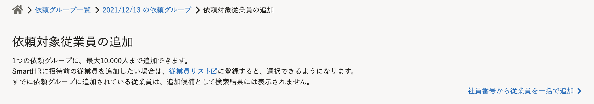

2021年12月14日（火）に行なったアップデートの詳細をお知らせします。

文書配付機能の変更点は、改善3件・不具合修正1件でした。

# 📈 改善

## 依頼グループに追加できる依頼対象従業員数の上限を10,000人に引き上げました

これまでは1依頼グループに追加できる依頼対象従業員の上限は5,000人でしたが、パフォーマンスを改善し、上限を10,000人に引き上げました。

なお、10,000人以上追加しようとした場合は、これまでと同様にエラーメッセージが表示されます。

## ［依頼対象従業員の追加］画面の説明文を見直しました

［依頼対象従業員の追加］画面の説明文を、以下のとおり見直しました。

- 依頼グループの依頼対象従業員の上限数（10,000人）を記載
- SmartHR基本機能の従業員リスト画面へのリンクを追加

| **変更前** | **変更後** |
| --- | --- |
|  |  |

## 書類テンプレートに挿入したリンク先を表示する場合、常に別タブで表示されるようにしました

これまで、テンプレート詳細や書類詳細画面で書類テンプレートに挿入したリンクを開く場合、同じタブ内でリンク先の画面が表示されていました。

今回の改修により、リンク先を開く場合は常に別タブで表示されるよう改善しました。

# 👨‍⚕️ 不具合修正

書類テンプレート編集画面の、表示に関する不具合を修正しました。
