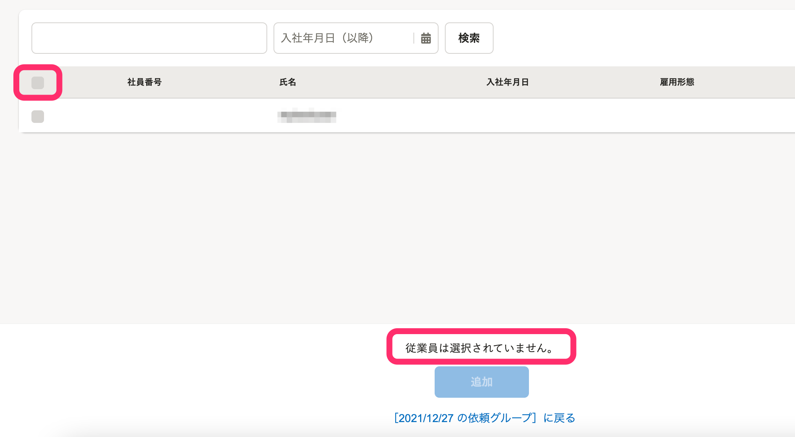

2022年1月11日（火）に行なったアップデートの詳細をお知らせします。

文書配付機能の変更点は、改善1件でした。

# 📈 改善

## 依頼対象従業員を追加する際、選択できる従業員がいない場合の挙動を改善しました

これまでは、依頼対象従業員の追加画面にある一括チェックのボックスをクリックすると、従業員一覧に選択できる従業員がいない場合は、ページ下部に **［このページの従業員0人すべてが選択されています。］** のメッセージが表示されていました。

今回の改修により、選択できる従業員がいない場合は、一括チェックのボックス自体をクリックできないようにし、メッセージも表示されないようにしました。

| 変更前 | 変更後 |
| --- | --- |
|  |  |
