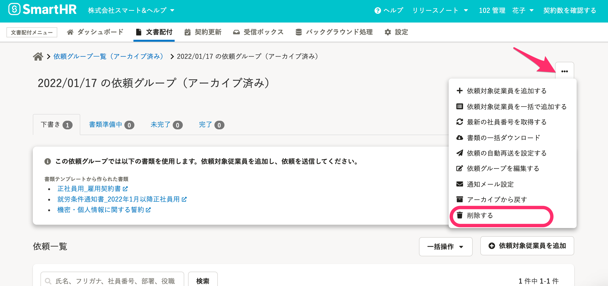
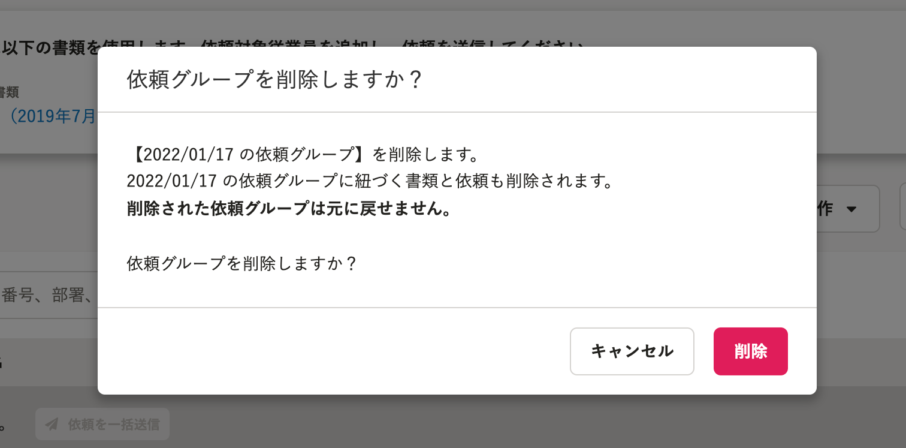
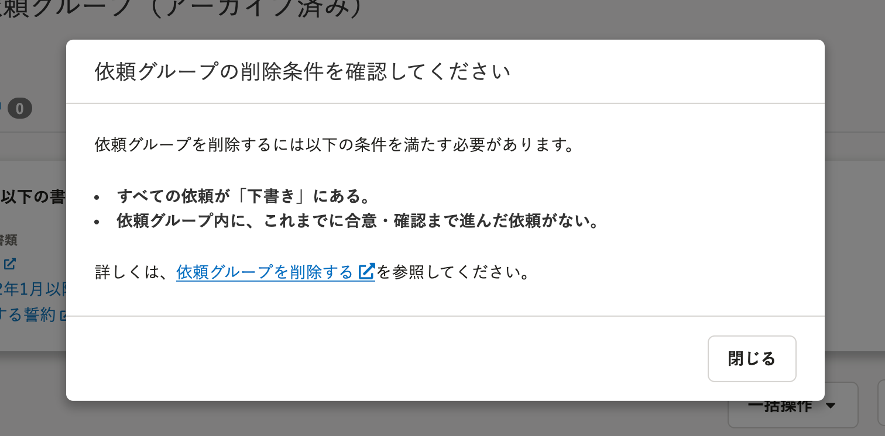

2022年1月18日（火）に行なったアップデートの詳細をお知らせします。

文書配付機能の変更点は、新機能1件・不具合修正1件でした。

# ✨ 新機能

## 依頼グループを削除できるようにしました

以下の条件をすべて満たす依頼グループを削除できるようにしました。

- アーカイブ済みの依頼グループ
- 依頼グループ内のすべての依頼が「下書き」にある
- 依頼グループ内に、これまでに合意・確認まで進んだ依頼がない

アーカイブした依頼グループ詳細画面の「下書き」タブを開き、 **［…］** メニューから **［削除する］** をクリックすると、削除確認ダイアログが表示されます。

**削除の条件を満たしている場合の削除確認ダイアログ**

**削除の条件を満たしていない場合の削除確認ダイアログ**

詳細は、下記のヘルプページを参照してください。

[依頼グループを削除する](https://knowledge.smarthr.jp/hc/ja/articles/4414720940185)

# 👨‍⚕️ 不具合修正

依頼対象従業員を一括追加する際の挙動に関する不具合を修正しました。
