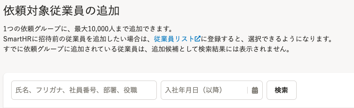
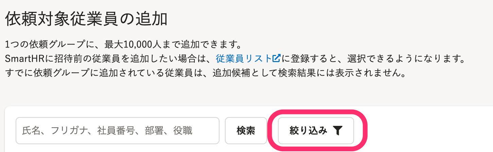
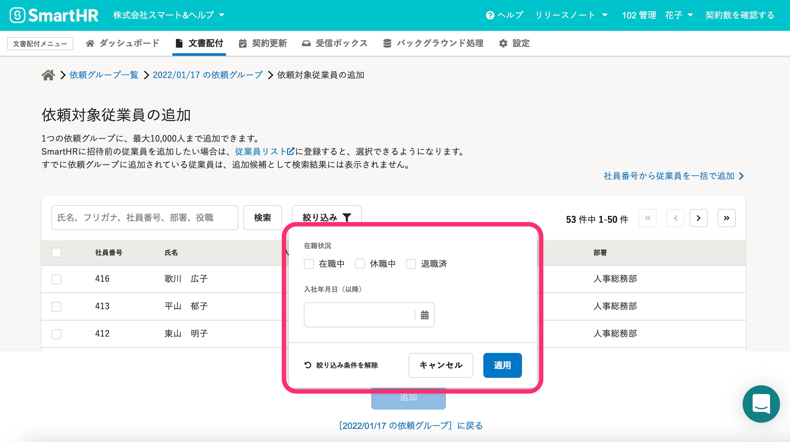

2022年1月25日（火）に行なったアップデートの詳細をお知らせします。

文書配付機能の変更点は、改善1件・不具合修正1件でした。

# 📈 改善

## 依頼対象従業員を在籍状況で絞り込みできるようにしました

依頼対象従業員を追加する際に、在籍状況で従業員を絞り込み表示できるようにしました。

あわせて **［入社年月日］** の設定も **［絞り込み］** のドロップダウンメニューの中にまとめました。

| 変更前 | 変更後 |
| --- | --- |
|  |  |

 **［絞り込み］** をクリックすると、 **［在籍状況］［入社年月日］** の設定項目が表示されます。

# 👨‍⚕️ 不具合修正

 **［依頼一覧］** の絞り込み条件に関する1件の不具合修正を行ないました。
