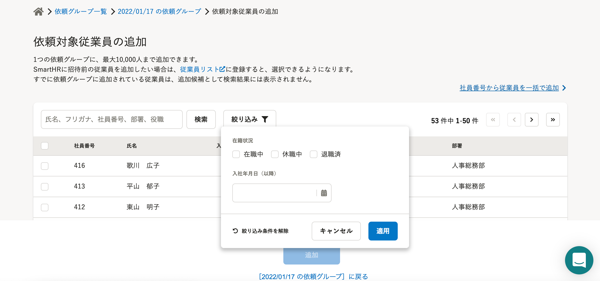
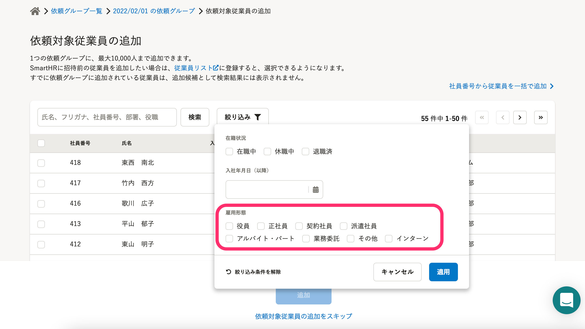

2022年1月31日（月）に行なったアップデートの詳細をお知らせします。

文書配付機能の変更点は、改善1件・アクセシビリティ1件・不具合修正1件でした。

# 📈 改善

## 依頼対象従業員を雇用形態でも絞り込みできるようにしました

依頼対象従業員を追加する際に、雇用形態でも従業員を絞り込み表示できるようにしました。

| 変更前 |  |
| --- | --- |
| 変更後 |  |

# 🎢 アクセシビリティ

## SmartHR UIのバージョンを、「16.0.2」から、現時点の最新バージョンである「17.2.0」にバージョンアップしました

より「見やすく」「使いやすい」画面に、見た目やアクセシビリティを改善しました。

# 👨‍⚕️ 不具合修正

書類一括ダウンロードをした際の挙動に関する1件の不具合修正を行ないました。
