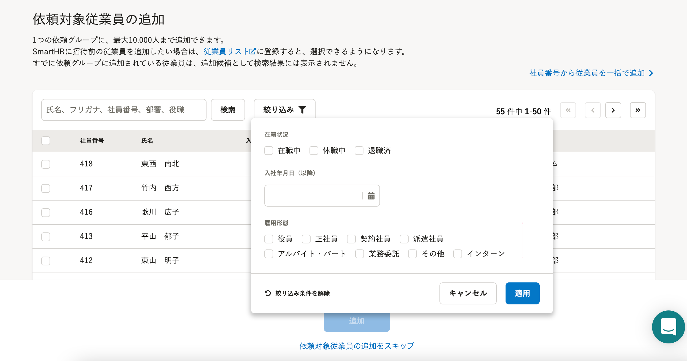
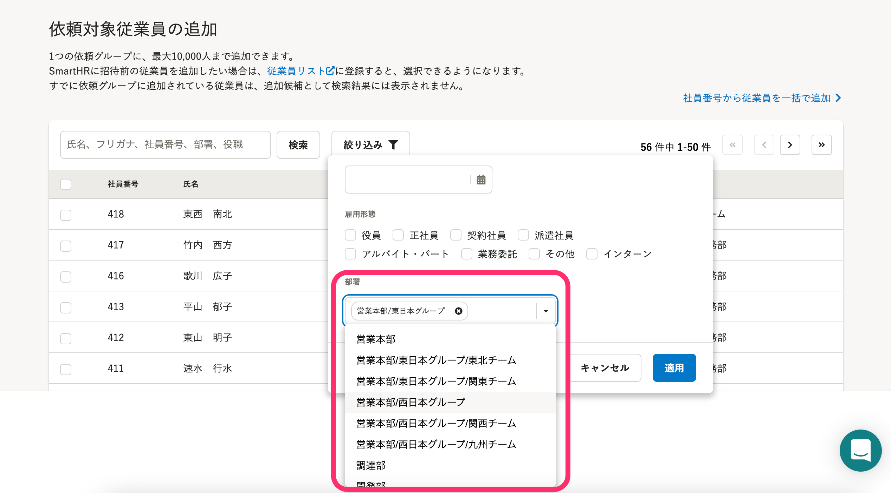

2022年2月8日（火）に行なったアップデートの詳細をお知らせします。

文書配付機能の変更点は、改善1件・不具合修正1件でした。

# 📈 改善

## 依頼対象従業員を部署でも絞り込みできるようにしました

依頼対象従業員を追加する際に、部署でも従業員を絞り込み表示できるようにしました。

部署は複数選択が可能です。

また、共同管理設定で部署の範囲を指定している場合は、その範囲の部署のみ表示されます。

| 変更前 |  |
| --- | --- |
| 変更後 |  |

# 👨‍⚕️ 不具合修正

依頼グループからまとめて依頼を取り消した際の通知に関する1件の不具合修正を行ないました。
