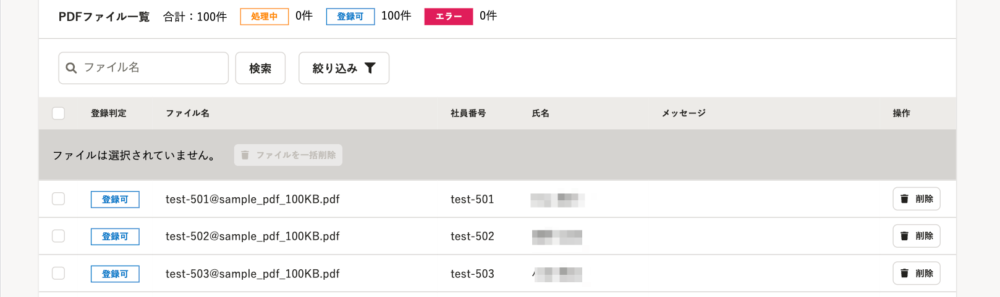
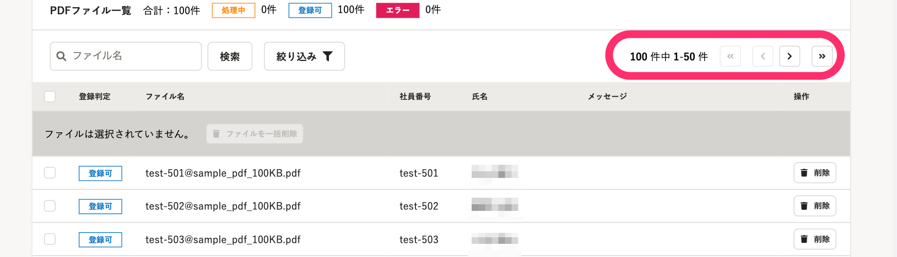
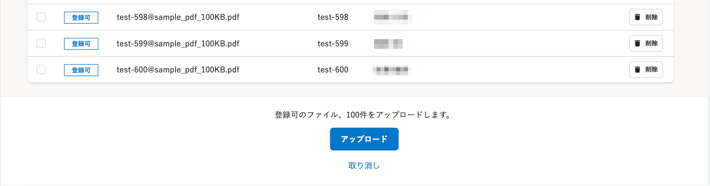
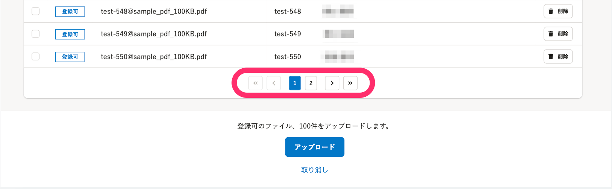
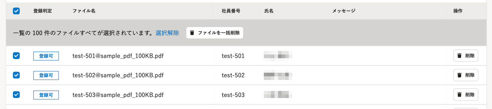
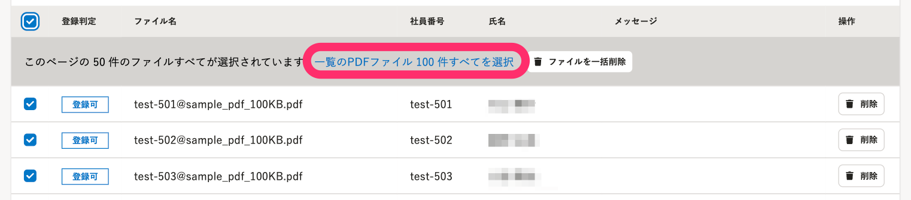

2022年2月18日（金）に行なったアップデートの詳細をお知らせします。

文書配付機能の変更点は、改善1件でした。

# 📈 改善

これまで、 **［別々のPDFファイルの一括アップロード］** 画面で、大量のPDFファイルをアップロードすると、ページ内に該当のPDFファイル全件を表示する仕様になっていたため、PDFファイルのアップロードに時間がかかっていました。

今回、1ページあたりの表示件数を50件に制限し、ページネーションを画面中央右と下部に配置することで、アップロード時間を改善しました。

| **変更前** | **変更後** |
| --- | --- |
|  |  |
|  |  |

また、複数のページをまたいだ場合に、PDFファイルを一括で選択できる機能も追加しました。

| **変更前** | **変更後** |
| --- | --- |
|  |  |
