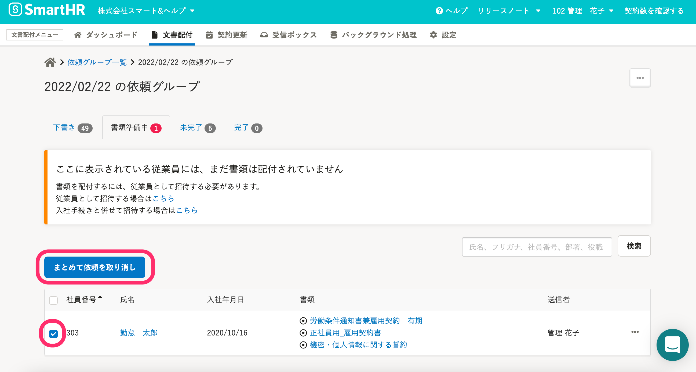

2022年2月22日（木）に行なったアップデートの詳細をお知らせします。

文書配付機能の変更点は、改善1件でした。

# 📈 改善

## 依頼グループ詳細画面の［書類準備中］タブの中で、複数の依頼を一括で取り消せるようにしました

これまでは、依頼グループ詳細画面の **［書類準備中］** タブの中で依頼を取り消す場合は、1件ずつ操作する必要がありました。

今回の改修により、 **［書類準備中］** タブにある複数の依頼も一括で取り消しできるようにしました。

従業員氏名の横にあるチェックボックスにチェックを入れ、 **［まとめて依頼を取り消し］** をクリックすると、選択した複数の依頼を一括で取り消せます。

