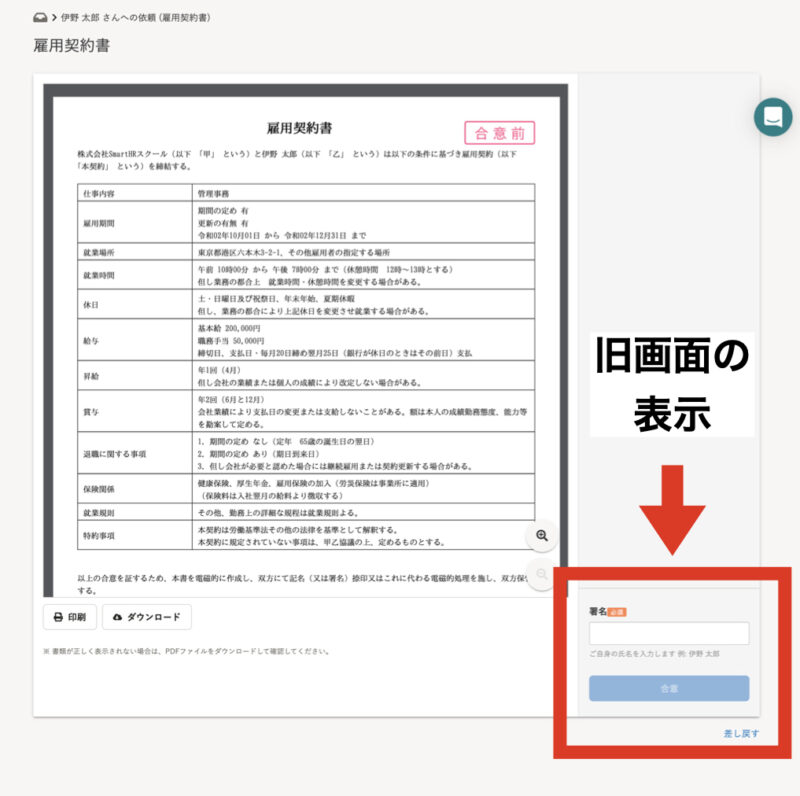
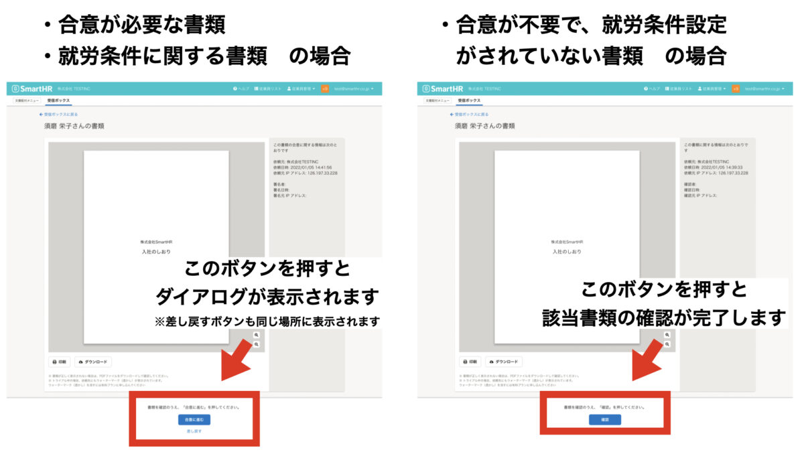
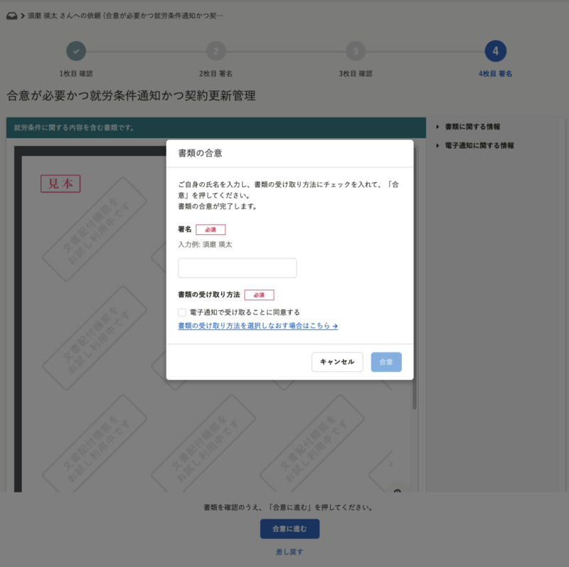

2022年3月1日（火）に行なったアップデートの詳細をお知らせします。

文書配付機能の変更点は、改善1件でした。

# 📈 改善

## 従業員が書類を合意・確認する画面を変更しました

これまで、従業員による **「署名」** の記入欄と **「合意」「確認」** ボタンは、書類詳細画面の右下（スマートフォンでは画面下）に表示していました。

しかし、合意が不要な書類の場合、 **「確認」** ボタンが押下されないことが多く、管理者側の画面では該当の依頼が完了にならず「未完了」タブに残ってしまっていました。

今回の改修では、従業員による書類の合意・確認画面を以下のように変更しました。

- **合意が必要な書類の場合**：画面下部に **［合意に進む］** ボタンを表示し、クリックするとダイアログが表示されます。ダイアログ内に、 **［署名］** の記入欄と **［合意］** ボタンを表示しています。
- **合意が不要で、就労条件に関する内容を含む書類の場合**：画面下部に **［確認に進む］** ボタンを表示し、クリックするとダイアログが表示されます。ダイアログ内に、 **［合意］** ボタンを表示しています。
- **合意が不要かつ、就労条件に関する内容を含む書類でない場合**：画面下部に **［確認］** ボタンを表示し、クリックすると確認が完了します。

詳しくは、下記のお知らせを参照してください。

[【リリース済】文書配付機能にて、従業員が書類を合意・確認する画面を変更しました](https://smarthr.jp/update/33088)

| 変更前 |   **書類詳細画面**     |
| --- | --- |
| 変更後 |   **書類詳細画面**     |
|   新規追加ダイアログ   |      |
