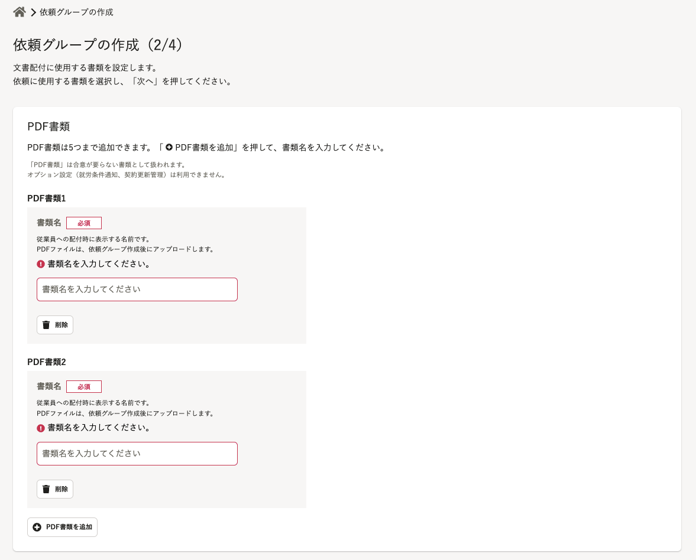
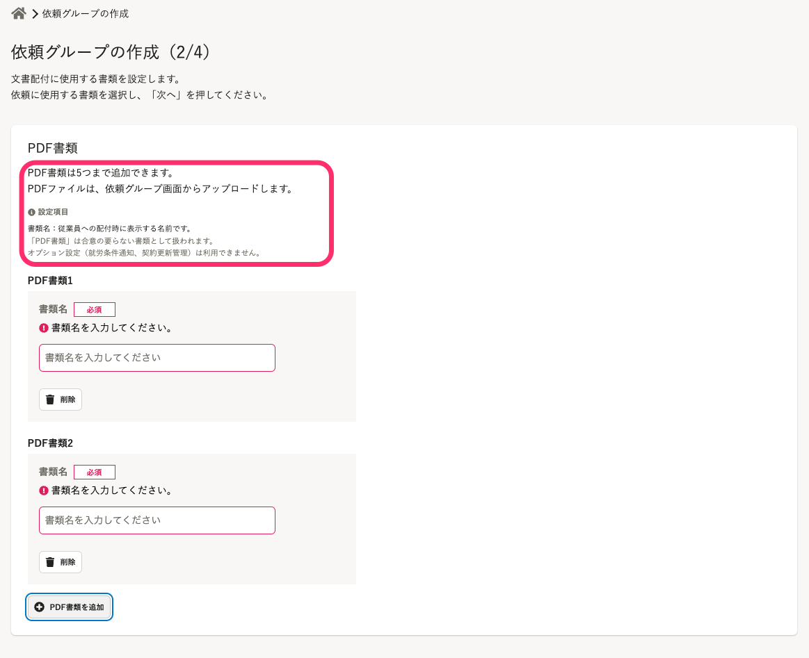

2022年3月2日（水）に行なったアップデートの詳細をお知らせします。

文書配付機能の変更点は、改善1件・不具合修正1件でした。

# 📈 改善

## 依頼グループの作成画面で、PDF書類の［書類名］の説明文を画面上部に移動させました

これまでは、依頼グループの作成画面にあるPDFの **［書類名］** の説明文が、複数のPDF書類を追加するたびに表示されていました。

冗長な印象があったため、今回の改修により画面上部に説明文を集約しました。

| 変更前 | 変更後 |
| --- | --- |
|  |  |

# 👨‍⚕️ 不具合修正

iOS端末で書類の署名欄に関する1件の不具合修正を行ないました。
