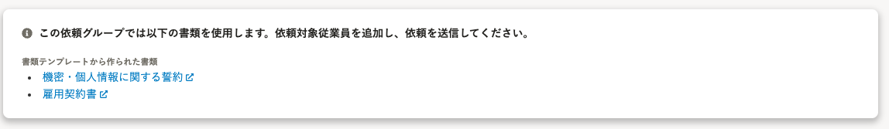
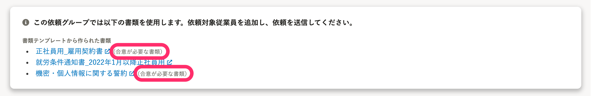

2022年3月14日（月）に行なったアップデートの詳細をお知らせします。

文書配付機能の変更点は、改善1件でした。

# 📈 改善

## 依頼グループ詳細画面から書類の合意要否をわかるようにしました

依頼グループ詳細画面の **［下書き］** タブで、使用している書類テンプレートに合意が必要な場合は、 **［（合意が必要な書類）］** を表示するようにしました。

| 変更前 |  |
| --- | --- |
| 変更後 |  |
