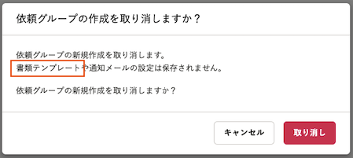
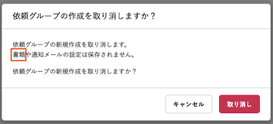

2022年3月24日（木）に行なったアップデートの詳細をお知らせします。

文書配付機能の変更点は、改善1件でした。

# 📈 改善

## 依頼グループの作成を取り消すダイアログ内の文言を変更しました

依頼グループの作成を取り消す際に表示されるダイアログ内の文言を、下図のとおり変更しました。

設定が保存されない対象には、書類テンプレートだけでなくPDF書類も含まれることから、「書類テンプレート」という表記を「書類」に変更しました。

| 変更前 | 変更後 |
| --- | --- |
|  |  |
