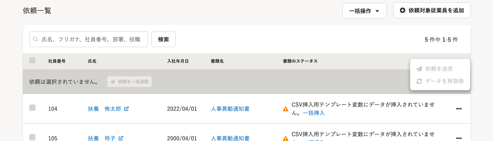
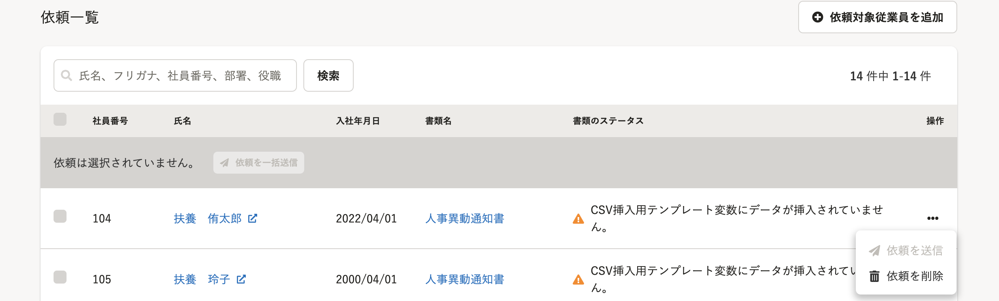

2022年5月31日（火）に行なったアップデートの詳細をお知らせします。

文書配付機能の変更点は、改善1件でした。

# 📈改善

## 共同管理設定されたアカウントの場合、依頼グループ詳細画面の［データの再取得］を非表示にするようにしました

これまでは、共同管理設定されたアカウントが依頼グループ詳細画面のメニューを開いた際、管理者権限でしか操作できない **［データの再取得］** がグレーアウトで表示されていました。

共同管理設定されたアカウントではデータの取得操作はできないため、今回の改修により、メニューに表示しないようにしました。

:::related
[管理者以外のアカウントと依頼グループを共同管理する](https://knowledge.smarthr.jp/hc/ja/articles/360026262613)
:::

|  変更前  |  変更後  |
| ---- | ---- |
|    |   |