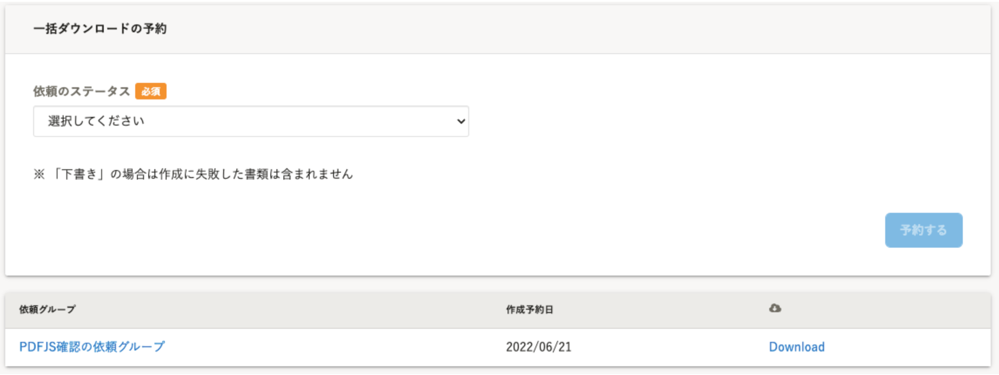
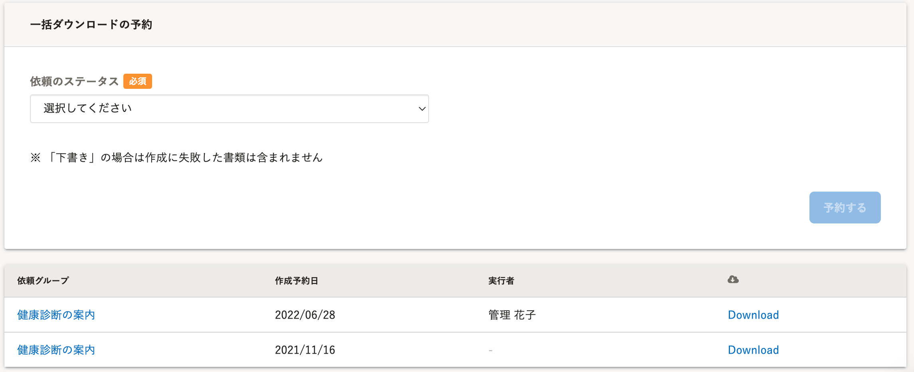

2022年6月27日（月）に行なったアップデートの詳細をお知らせします。

文書配付機能の変更点は、改善1件でした。

# 📈改善

## 書類の一括ダウンロード画面に［実行者］を表示するようにしました

書類を一括ダウンロードした際に実行者を記録し、書類の一括ダウンロード画面に **［実行者］** として表示するようにしました。

本リリース前に実行した書類の一括ダウンロードは実行者が記録されていないため、 **［実行者］** の項目が **［-］** で表示されます。

|  変更前  |  変更後  |
| ---- | ---- |
|    |    |