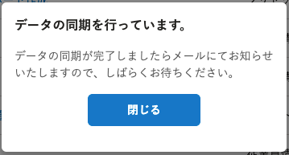
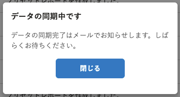
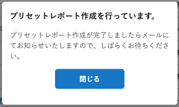
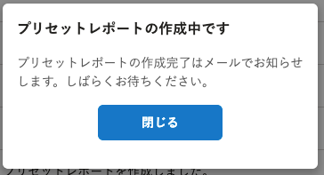

2021年11月30日（火）に行なったアップデートの詳細をお知らせします。

分析レポートの変更点は、改善1件・不具合修正1件でした。

# 📈 改善

## データの同期やプリセットレポートの作成時に表示されるダイアログの文章などを、ライティングガイドに沿ってわかりやすくしました

SmartHR全体での表記ルールに合わせるため、 **［データを同期］** および **［プリセットレポートの作成］** の実行時に表示されるダイアログの見出しと本文などを見直しました。

「冗長な日本語を避ける」、「敬語を使いすぎない」という方針に沿って修正しました。

:::related
[基本原則｜SmartHR Design System](https://smarthr.design/foundation/)
:::

| **修正前** | **修正後** |
| --- | --- |
|  |  |
|  |  |

# 👨‍⚕️ 不具合修正

データ項目の対応付け設定で存在しないデータ項目を設定した際の挙動に関する1件の不具合修正を行ないました。
