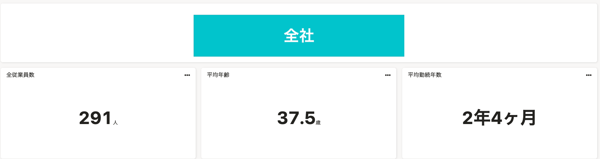
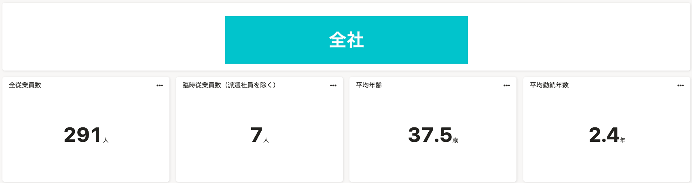

2021年12月10日（金）に行なったアップデートの詳細をお知らせします。

分析レポートの変更点は、改善1件でした。

# 📈 改善

## 「組織情報レポート」に新しいグラフを追加、既存のグラフの表記を変更しました

プリセットレポートの「組織情報レポート」に「臨時従業員数（派遣社員を除く）」グラフを追加しました。

また、「組織情報レポート」の「平均勤続年数」グラフの表記を**○年○ヶ月**から**○年**単位に変更しました。

※この変更は新しく作成したプリセットレポートに適用されます。作成済みのプリセットレポートには反映されません。

| **変更前** | **変更後** |
| --- | --- |
|  |  |
