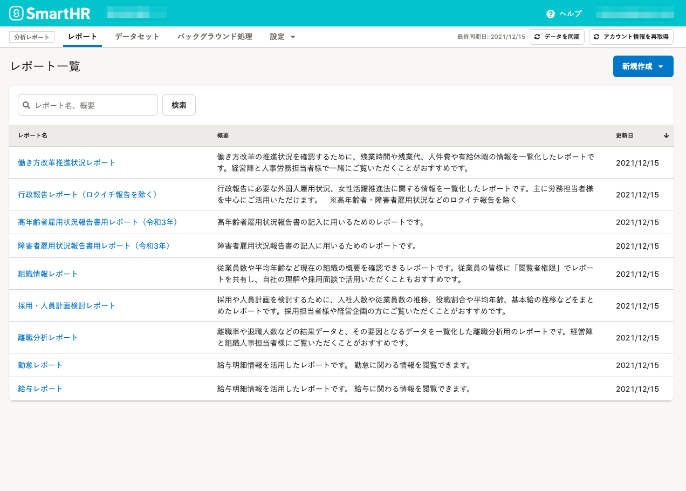
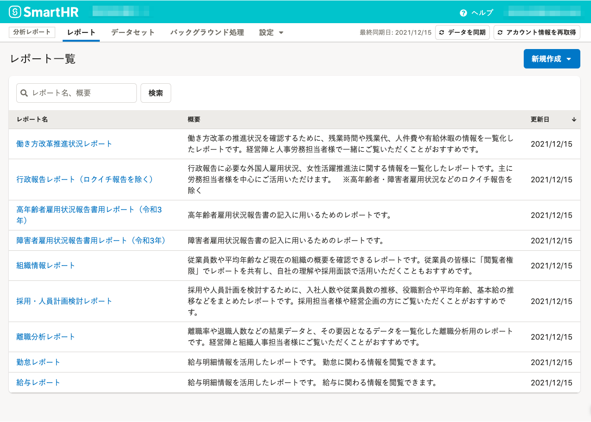

2021年12月16日（木）に行なったアップデートの詳細をお知らせします。

分析レポートの変更点は、アクセシビリティ1件でした。

# 🎢 アクセシビリティ

## 文字サイズをSmartHR Design Systemに定められている基準値に合わせました

これまでは、基準となるフォントサイズは14pxでしたが、SmartHR Design Systemに定められている基準値に合わせて16pxに変更しました。

| **変更前** | **変更後** |
| --- | --- |
|  |  |

:::related
[タイポグラフィ｜SmartHR Design System](https://smarthr.design/products/design-tokens/typography/)
:::
