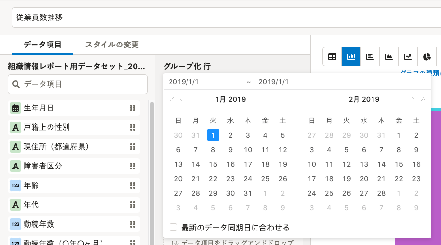
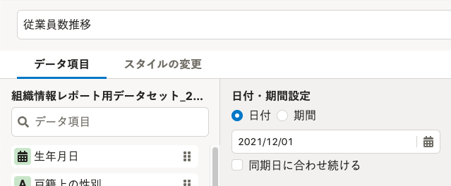
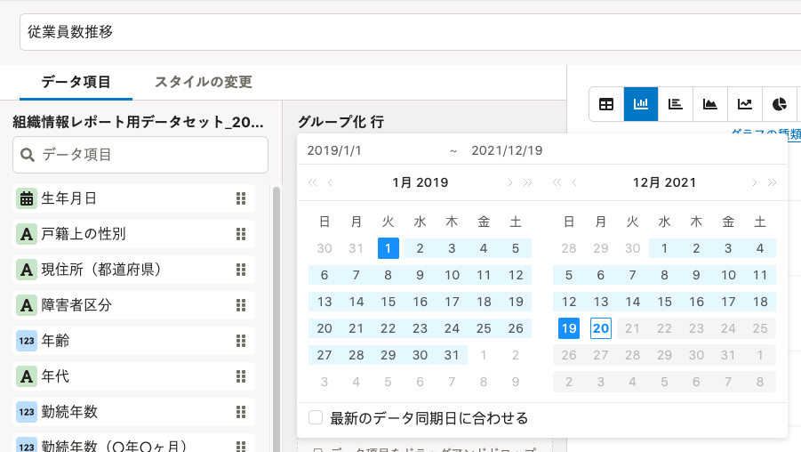
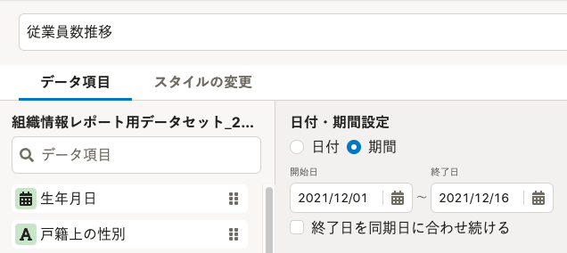

2021年12月20日（月）〜21日（火）に行なったアップデートの詳細をお知らせします。

分析レポートの変更点は、改善1件・不具合修正2件でした。

# 📈 改善

## 日付・期間設定を新しいデザインに変更しました

グラフ編集画面の「日付・期間設定」項目を設けました。

グラフに表示されている日付または期間の設定状況がわかりやすく、また、より直感的に操作できるようにしました。

| **変更前** | **変更後** |
| --- | --- |
|  |  |
|  |  |

# 👨‍⚕️ 不具合修正

レポートやデータセットを部署単位で共有する際の通知に関する不具合をはじめ、計2件を修正しました。
