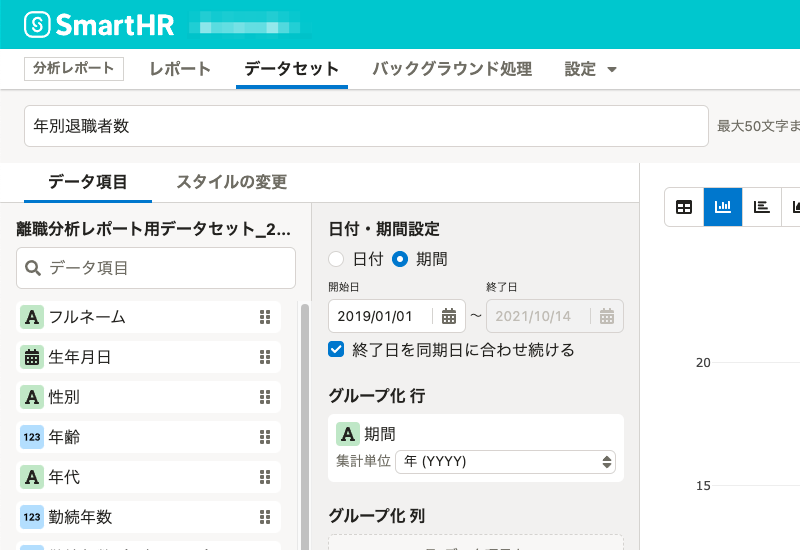
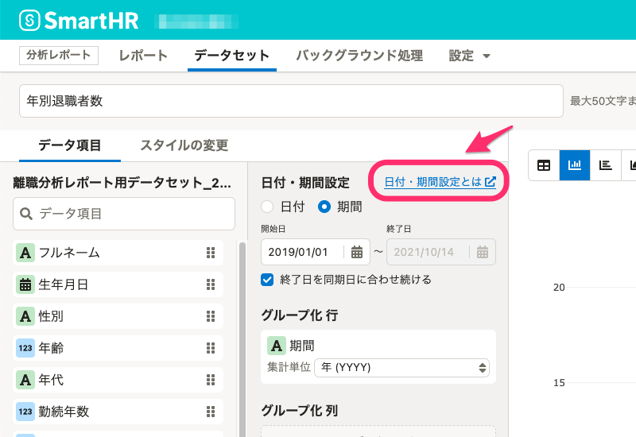

あけましておめでとうございます🎍 本年も分析レポートをよろしくお願いいたします。

2022年1月5日（水）に行なったアップデートの詳細をお知らせします。

分析レポートの変更点は、改善1件・不具合修正2件でした。

# 📈 改善

## グラフ編集ページ内に「日付・期間設定」のヘルプページのリンクを追加しました。

追加したヘルプページには、2021年12月20-21日に行なったデザイン変更の内容を反映しています。

[2021/12/20-21 日付・期間設定を新しいデザインに変更しました 他2件](https://knowledge.smarthr.jp/hc/ja/articles/4412659576857-2021-12-20-21-%E6%97%A5%E4%BB%98-%E6%9C%9F%E9%96%93%E8%A8%AD%E5%AE%9A%E3%82%92%E6%96%B0%E3%81%97%E3%81%84%E3%83%87%E3%82%B6%E3%82%A4%E3%83%B3%E3%81%AB%E5%A4%89%E6%9B%B4%E3%81%97%E3%81%BE%E3%81%97%E3%81%9F-%E4%BB%962%E4%BB%B6#toc--1)

| **変更前** | **変更後** |
| --- | --- |
|  |  |

# 👨‍⚕️ 不具合修正

ロクイチ報告用のプリセットレポート作成に関する不具合をはじめ、計2件を修正しました。
