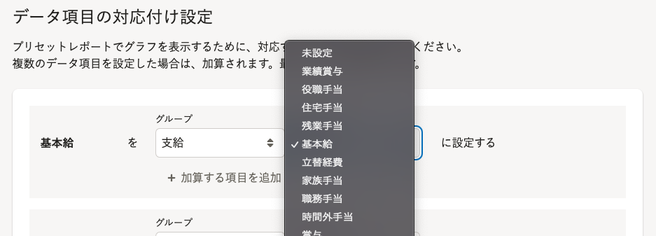
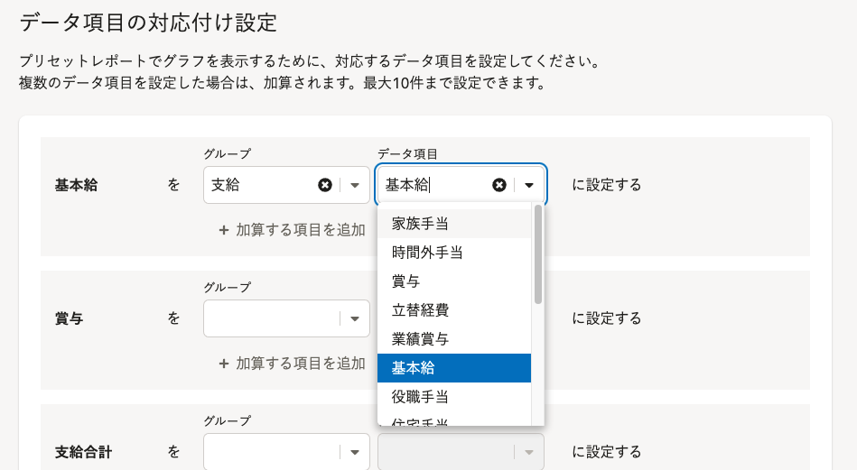

2022年1月24日（月）に行なったアップデートの詳細をお知らせします。

分析レポートの変更点は、改善1件でした。

# 📈 改善

## 「データ項目の対応付け設定」の項目を絞り込んで選択できるようになりました

これまでは項目の絞り込みができず、設定したい項目を多数の項目から探す必要がありました。

今回の改善により、文字を直接入力して項目を絞り込んだ状態で選択できるようにしました。

| **変更前** | **変更後** |
| --- | --- |
|  |  |
