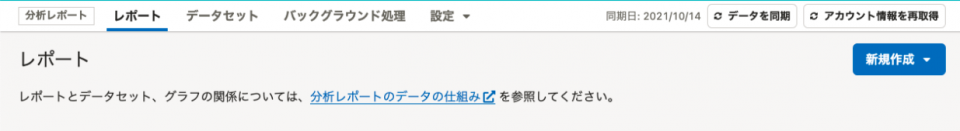
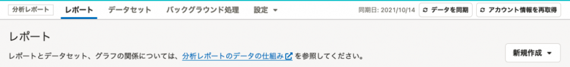
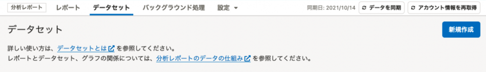
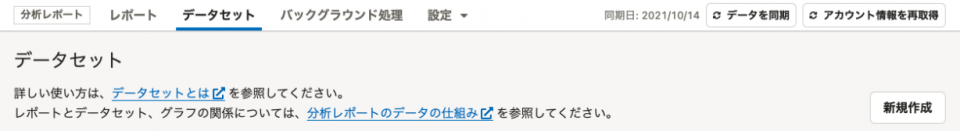

2022年2月4日（金）に行なったアップデートの詳細をお知らせします。

分析レポートの変更点は、改善1件でした。

# 📈 改善

## レポート一覧とデータセット一覧の新規作成ボタンをSmartHR Design Systemに準拠しました

SmartHR全体のガイドラインに合わせて、新規作成ボタンをよりテーブルに近い位置に配置し、色を変更しました。

| **変更前** | **変更後** |
| --- | --- |
|  |  |
|  |  |

:::related
[コレクション/「よくあるテーブル」のレイアウトパターン | プロダクト | SmartHR Design System](https://smarthr.design/products/design-guide/smarthr-table/)
:::
