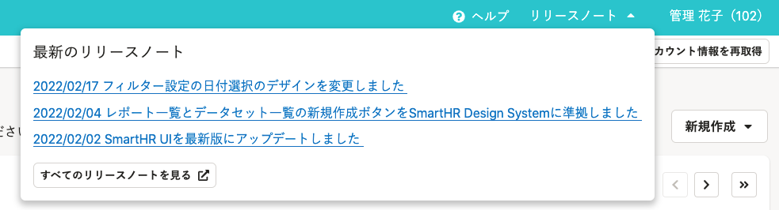
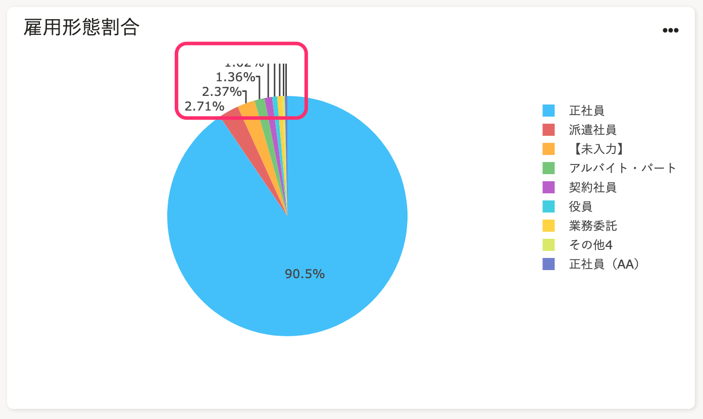
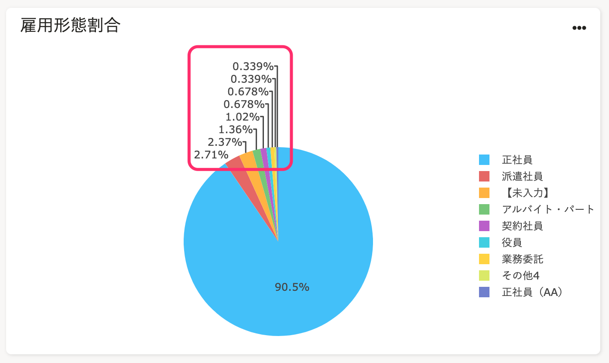
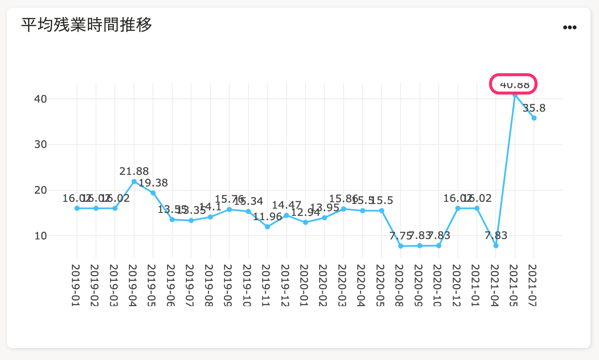
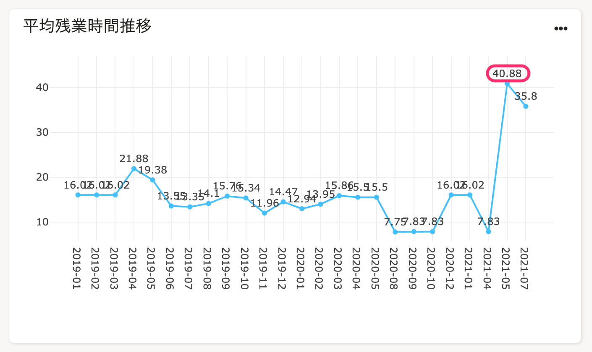

2022年2月21日（月）、22日（火）に行なったアップデートの詳細をお知らせします。

分析レポートの変更点は、改善2件でした。

# 📈 改善

## ヘッダーにリリースノートへのリンクを追加しました

ヘッダーに、分析レポートのリリースノート一覧と最新記事3件へのリンクを追加しました。

 **［リリースノート  ］** を押すと、最新記事3件のタイトルを表示します。

記事タイトルからはそれぞれの記事に、 **［すべてのリリースノートを見る  ］** からは分析レポートのリリースノート一覧に遷移できます。

## 見切れて表示されていたグラフの数値（データラベル）表示を正しました

これまでは、グラフの数値（データラベル）がグラフの表示範囲内に収まっておらず、文字が見切れていました。

今回のリリースで、グラフの数値（データラベル）がグラフの範囲内に収まるように改善しました。

| **変更前** | **変更後** |
| --- | --- |
|  |  |
|  |  |
