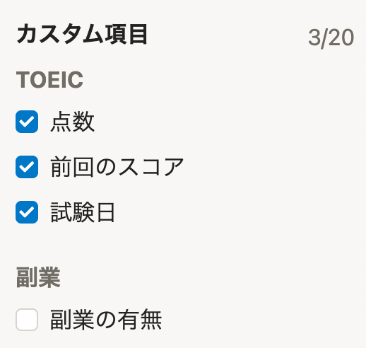
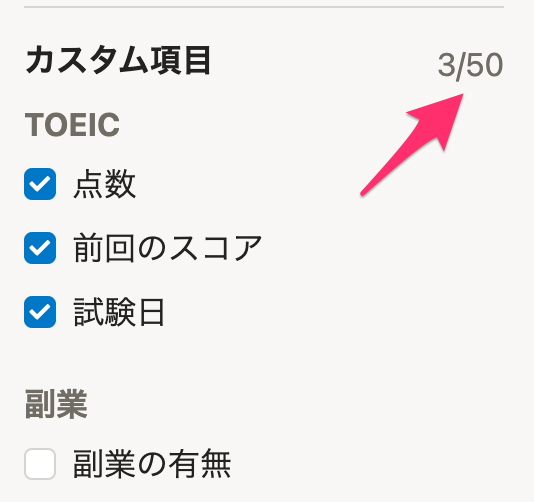
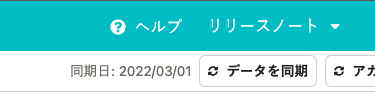
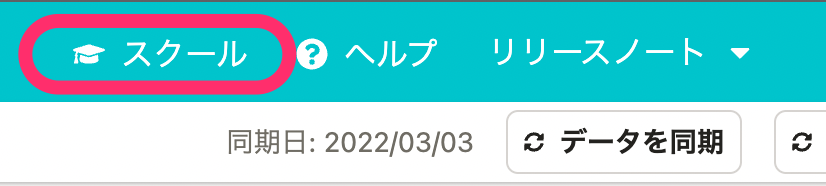
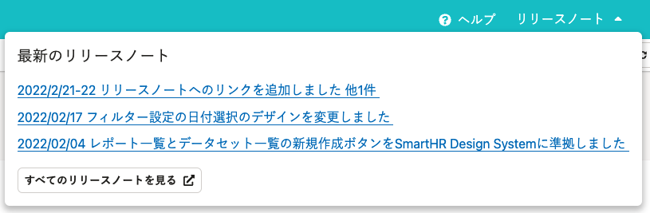
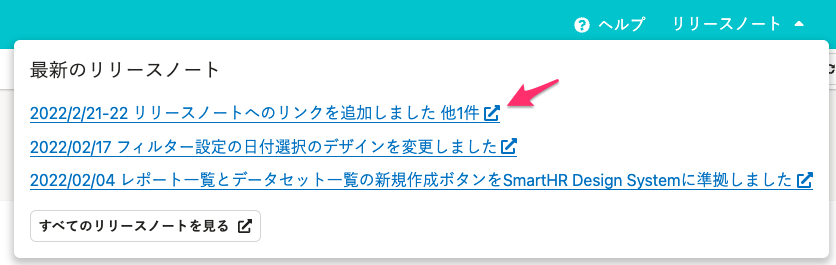

2022年3月1日（火）〜3日（木）に行なったアップデートの詳細をお知らせします。

分析レポートの変更点は、改善2件・アクセシビリティ1件でした。

# 📈 改善

## データセットとグラフで利用できるカスタム項目の上限が20個から50個に増えました

データセットで扱えるカスタム項目の上限が、20個から50個に増えました！

この変更により、より多くのカスタム項目を使ってさらに深い分析ができるようになりました。

また、1つのデータセットで扱えるカスタム項目の数が増えたことでデータセットを分割する必要がなくなり、より少ないデータセットで分析できます。

| **変更前** | **変更後** |
| --- | --- |
|  |  |

## SmartHRスクール（分析レポート）への動線を、ヘッダーに追加しました

管理者権限アカウントのユーザーに対して、ヘッダーにSmartHRスクールへのリンクを追加しました。

基本的な使い方に困ったら、SmartHRスクールを利用してください。

| **変更前** | **変更後** |
| --- | --- |
|  |  |

# 🎢 アクセシビリティ

## ヘッダーに表示されるリリースノートへのリンクに、外部ウィンドウでページが開く旨を伝えるアイコンを追加しました

リンクの末尾に、リンクをクリックすると外部ウィンドウでページが開く旨を伝えるアイコンを設置しました。

| **変更前** | **変更後** |
| --- | --- |
|  |  |
