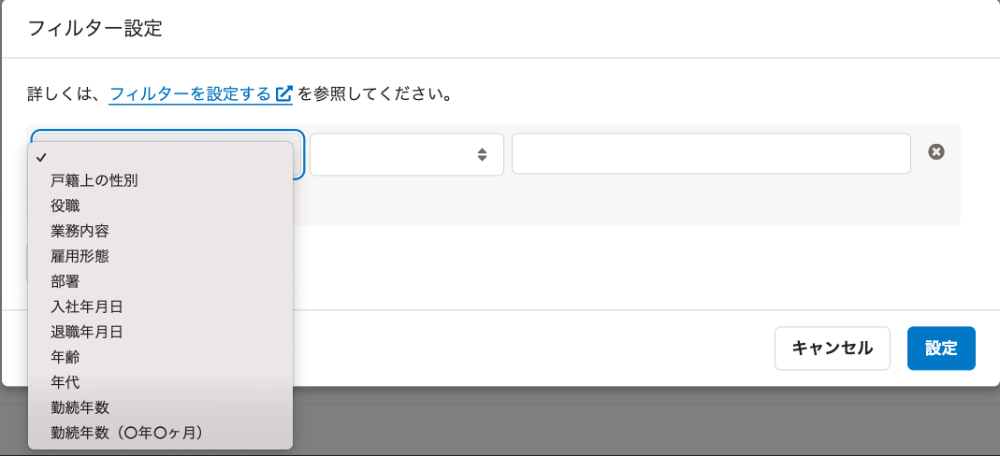
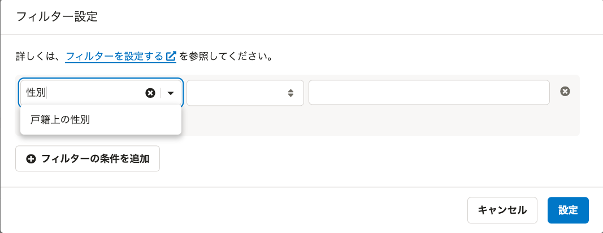
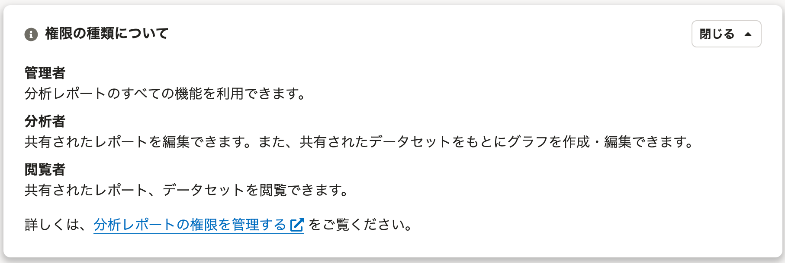
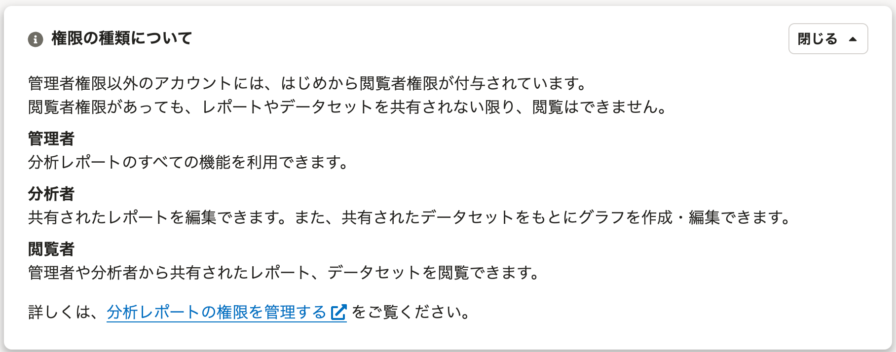

2022年3月14日（月）に行なったアップデートの詳細をお知らせします。

分析レポートの変更点は、改善2件・不具合修正1件でした。

# 📈 改善

## フィルターのメニュー項目が検索可能になりました

フィルター設定画面で、メニューから項目を選択する際に文字列で検索できるようになりました。

| **変更前** | **変更後** |
| --- | --- |
|  |  |

## 閲覧者権限についての説明を追記しました

閲覧者権限に関する説明がUI上でされていなかったことで、「閲覧者権限が付与されていると、共有されていなくてもレポートやデータセットが閲覧できてしまうのではないか」という不安の声をいただいていました。

権限設定画面に表示している「権限の種類について」に、以下2つの内容を追記しました。

- 管理者以外のすべてのアカウントには、はじめから閲覧者権限が付与されていること
- 閲覧者権限が付与されていても、レポートやデータセットは共有されない限り閲覧できないこと

| **変更前** | **変更後** |
| --- | --- |
|  |  |

# 👨‍⚕️ 不具合修正

離職率のグラフにフィルターを設定したときの表示の不具合を修正しました。
