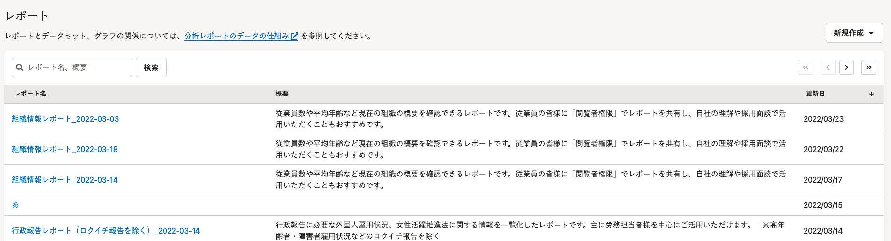
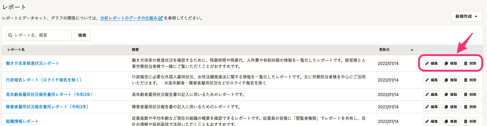
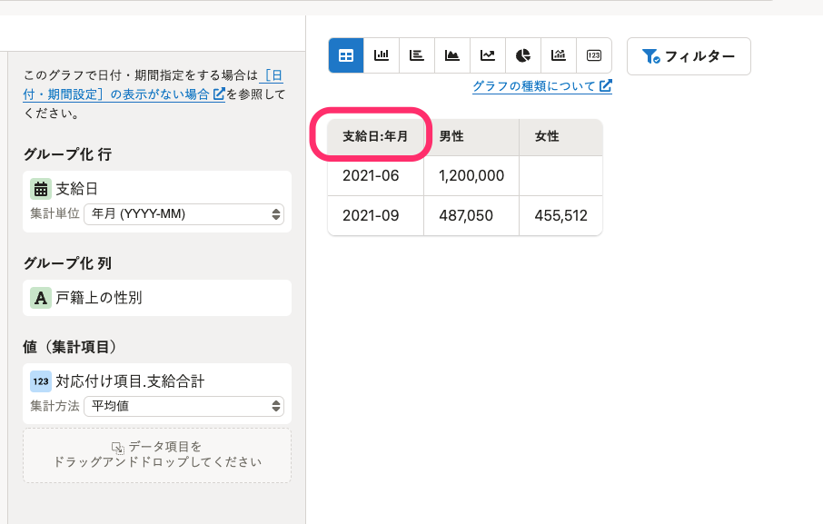
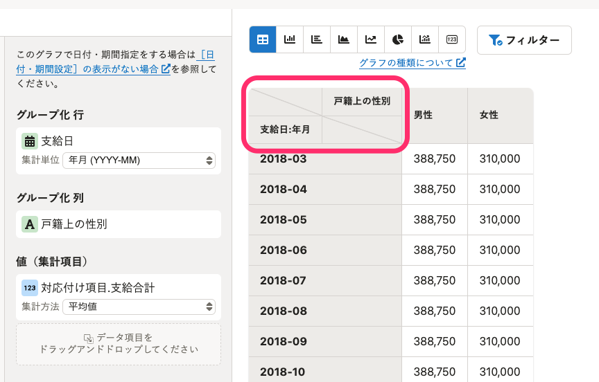
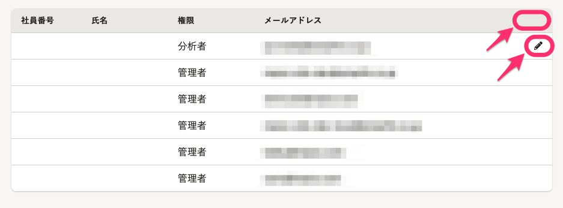
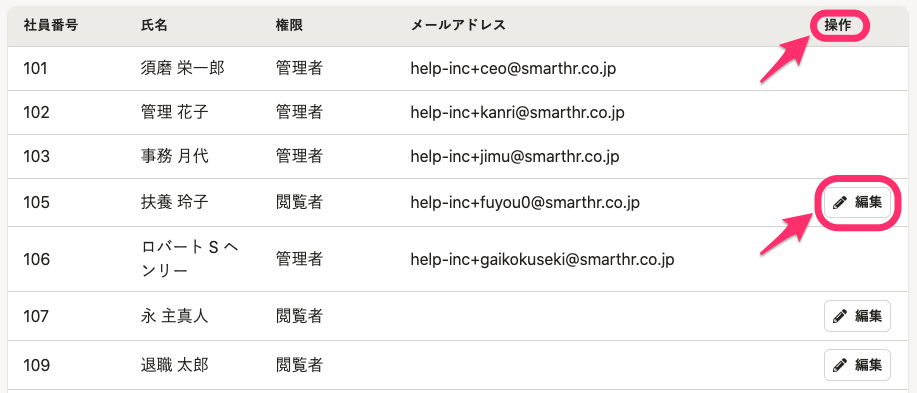

2022年3月28日（月）に行なったアップデートの詳細をお知らせします。

分析レポートの変更点は、新機能1件・改善1件・アクセシビリティ1件でした。

# ✨ 新機能

## レポート一覧画面からレポートを編集・複製・削除できるようにしました

これまで、レポートの編集・複製はレポートの詳細画面、レポートの削除はレポートの編集画面からでしか実行できず、操作のステップが多い状況でした。

今回のリリースにより、レポート一覧画面から「編集・複製・削除」の操作が可能になり、操作がラクラクになりました！

| **変更前** | **変更後** |
| --- | --- |
|  |  |

# 📈 改善

## ストレートテーブルに「グループ化 列」に設定した項目名を表示しました

これまでは「グループ化 行」と「グループ化 列」に項目を設定していても、ストレートテーブルには「グループ化 行」の項目名しか表示していませんでした。

今回のリリースにより、「グループ化 列」に設定した項目名をストレートテーブルに表示するようにしました。

| **変更前** | **変更後** |
| --- | --- |
|  |  |

# 🎢 アクセシビリティ

## 権限設定ページのテーブルをSmartHR Design Systemに準拠しました

SmartHR全体のガイドラインに合わせて、ヘッダーに「操作」を追加し、編集ボタンのUIを修正しました。

| **変更前** | **変更後** |
| --- | --- |
|  |  |

:::related
[コレクション/「よくあるテーブル」のレイアウトパターン | プロダクト | SmartHR Design System](https://smarthr.design/products/design-guide/smarthr-table/)
:::
