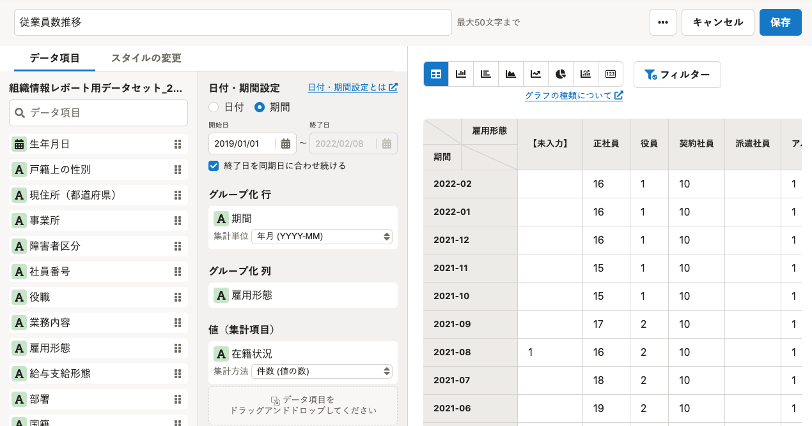
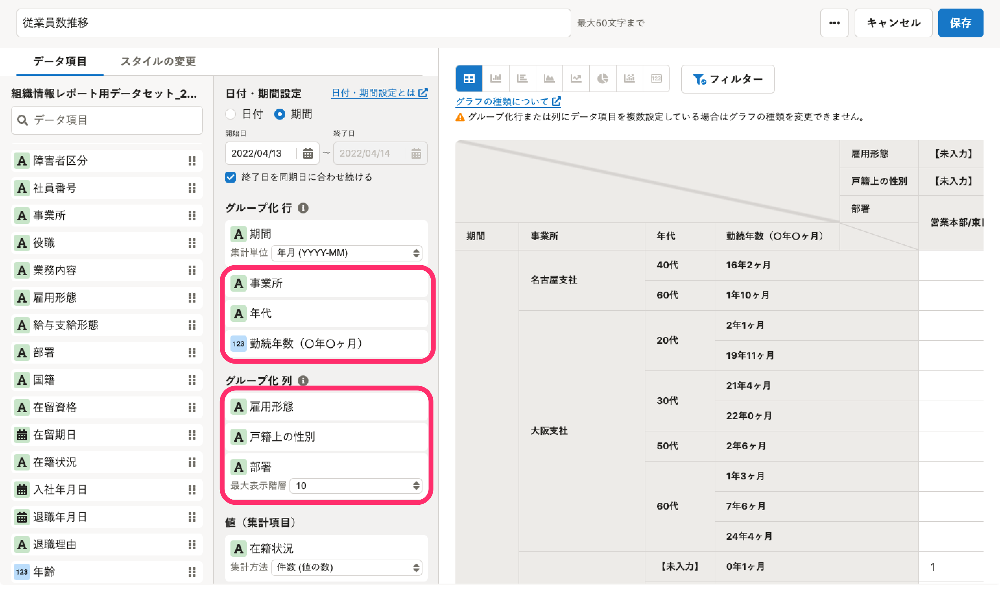

2022年4月14日（木）に行なったアップデートの詳細をお知らせします。

分析レポートの変更点は、新機能1件でした。

# ✨ 新機能

## ストレートテーブルで［グループ化 行・列］に複数のデータ項目を設定できるようになりました

これまでは、 **［グループ化 行・列］** のそれぞれに1つしかデータ項目を設定できませんでしたが、今回のリリースで最大3つまで設定できるようになりました。

1つのグラフで可視化できる指標が増え、より複雑な分析ができます。

なお、日付・期間設定で **［期間］** を選択している場合でも、 **［グループ化 行］** には期間を除いて最大3つまでデータ項目を設定できます。

データ項目の複数設定は、データソースが「従業員情報」かつ、グラフの種類が「ストレートテーブル」の場合のみ利用できます。

| **変更前** | **変更後** |
| --- | --- |
|  |  |

:::related
[表に複数のデータ項目を設定する](https://knowledge.smarthr.jp/hc/ja/articles/5564202020377)
:::
