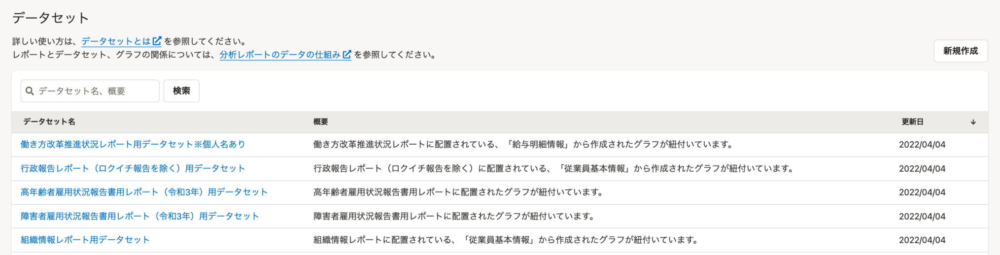
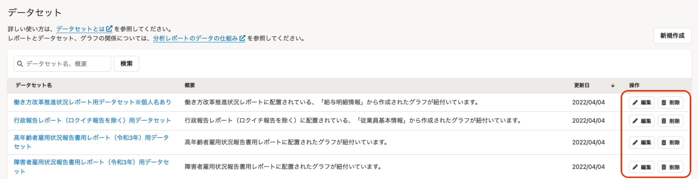
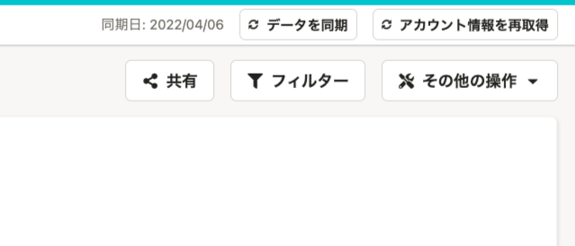
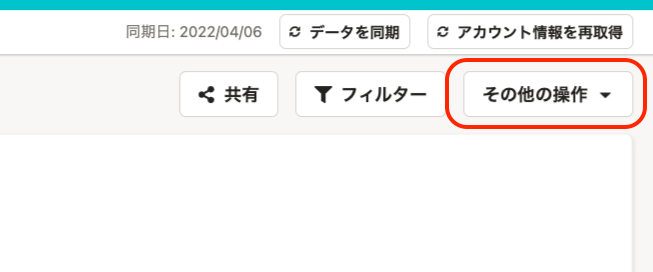

2022年4月15日（金）に行なったアップデートの詳細をお知らせします。

分析レポートの変更点は、新機能1件・改善1件でした。

# ✨ 新機能

## データセット一覧画面からデータセットを編集・削除できるようにしました

これまで、データセットの編集はデータセットの詳細画面、データセットの削除はデータセットの編集画面からでしか実行できず、操作のステップが多い状況でした。

今回のリリースにより、データセット一覧画面から「編集・削除」の操作が可能になり、操作がラクラクになりました！

| **変更前** | **変更後** |
| --- | --- |
|  |  |

# 📈 改善

## 「その他の操作」ボタンの左側のアイコンを削除しました

これまでは「その他の操作」ボタンの左右にアイコンがありましたが、SmartHR Design Systemでは左右のアイコンを同時に指定しないことを推奨しているため、「その他の操作」ボタンの左側のアイコンを削除しました。

| **変更前** | **変更後** |
| --- | --- |
|  |  |

:::related
[コレクション/「よくあるテーブル」のレイアウトパターン | プロダクト | SmartHR Design System](https://smarthr.design/products/design-guide/smarthr-table/)
[Button | コンポーネント | SmartHR Design System](https://smarthr.design/products/components/button/#h3-6)
:::
