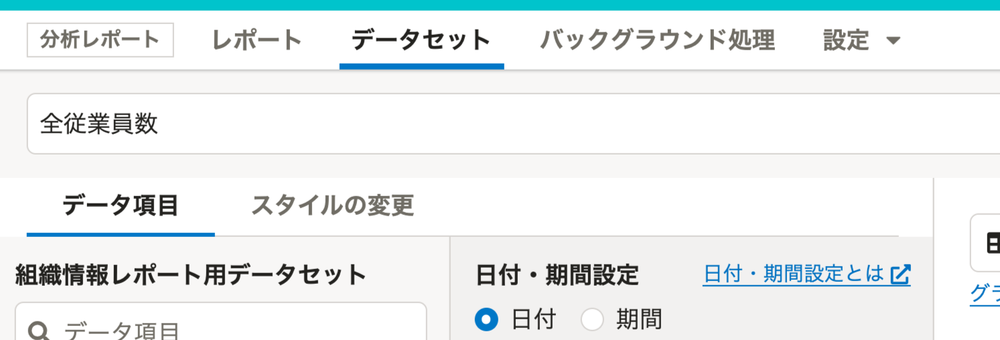
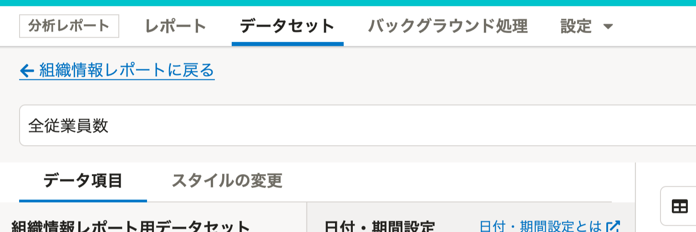
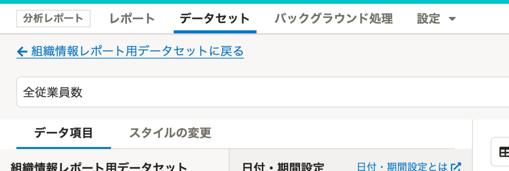

2022年5月10日（火）に行なったアップデートの詳細をお知らせします。

分析レポートの変更点は、改善2件でした。

# 📈改善

## グラフ編集画面から元のページに戻るリンクを追加しました

これまでは、グラフの編集画面には元のページ（直前に表示していたページ）に戻るリンクがありませんでした。
元のページに戻るには、グラフの保存またはキャンセルの操作をするか、ブラウザの戻るボタンを使う必要がありましたが、今回のリリースにより、グラフの編集画面からワンクリックで元のページに戻れるようにしました。

| **変更前** | **変更後(レポート詳細から遷移)** | **変更後(データセット詳細から遷移)** |
| --- | --- | --- |
|  |  |  |

## 複製したレポート、データセット、グラフ名の頭に（コピー）をつけるよう変更しました

これまでは、複製したレポート、データセット、グラフの名称は「[元の名前]のコピー」と表示していました。
SmartHR Design Systemのライティングガイドラインに沿って名称の頭に（コピー）を表示することで、レポート、データセット、グラフの一覧画面で複製したものを判別しやすくしました。
:::related
[複製したオブジェクトは、オブジェクト名の頭に（コピー）をつける｜SmartHR Design System](https://smarthr.design/products/contents/writing-style/#recNMnMROpX6yK9CR-0)
:::

