2022年5月16日（月）に行なったアップデートの詳細をお知らせします。

分析レポートの変更点は、改善1件でした。

# 📈改善
## SmartHR Design Systemのガイドラインに準拠していないUIを修正しました
既存画面を見直し、SmartHR Design Systemのガイドラインに準拠するよう修正しました。

レポート詳細画面のウィジェットのプルダウンメニューを「…」から「操作」に変更しました。

| **変更前** | **変更後** |
| --- | --- |
| 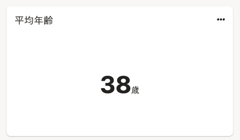 | 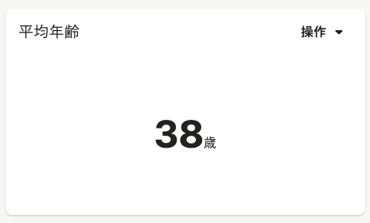 |

フィルターを設定するボタン名を **［設定］から［保存］** に修正しました。

| **変更前** | **変更後** |
| --- | --- |
| 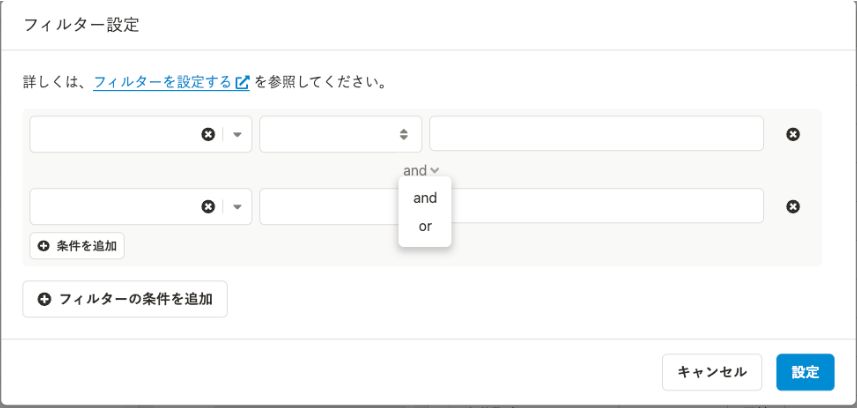  | 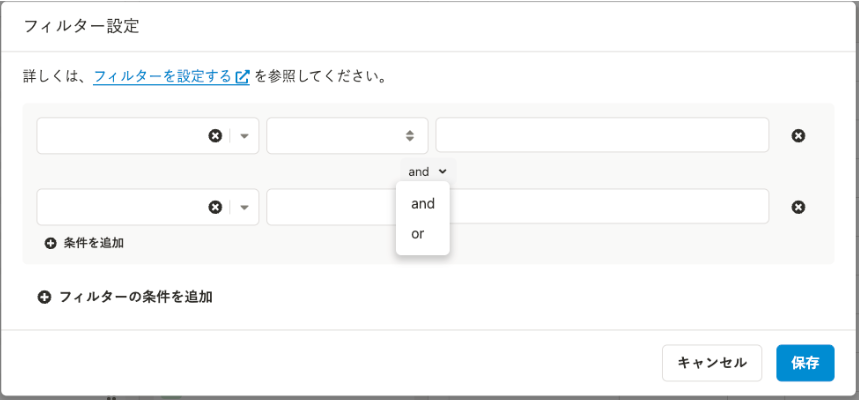 |

入力時のエラー表示はテキスト入力欄の下に表示していましたが、テキスト入力フィールドの上に移動しました。
また、グラフ設定とデータセット設定のダイアログのタイトルを修正しました。

| **変更前** | **変更後** |
| --- | --- |
| 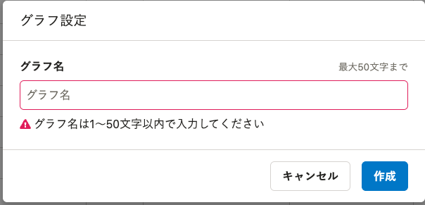 | 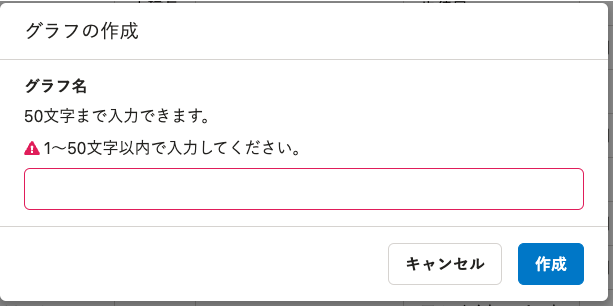 |
| 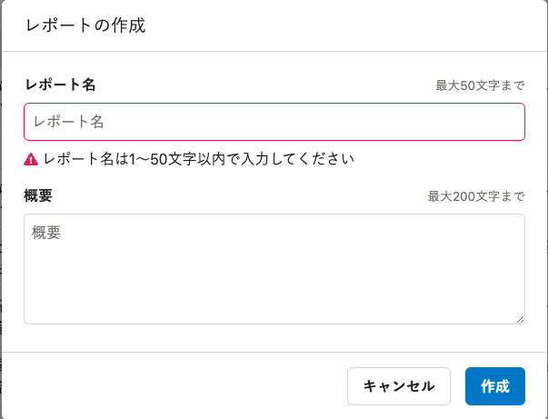 | 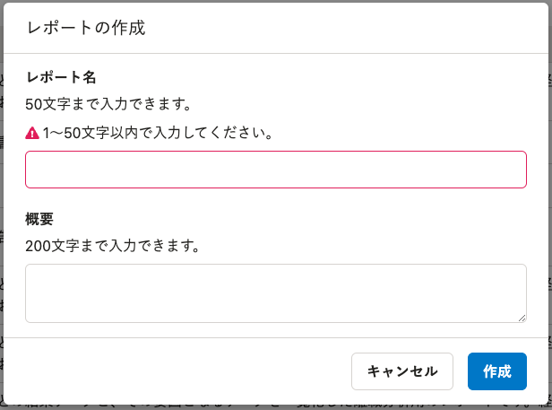 |
| 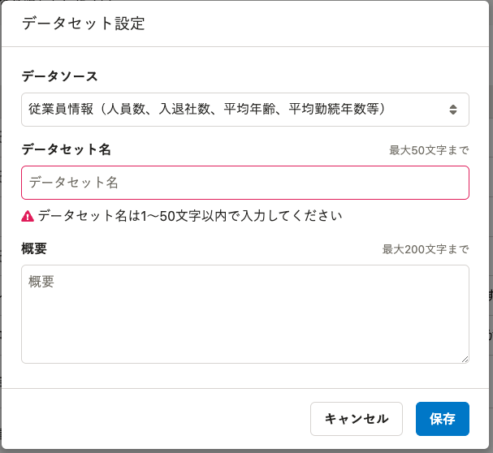 | 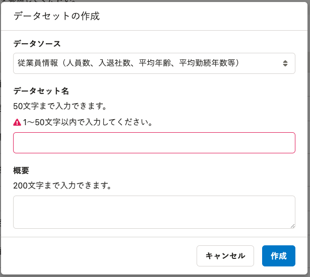 |

データセット詳細画面の「グラフを作成」ボタンの色を変更しました。

| **変更前** | **変更後** |
| --- | --- |
| 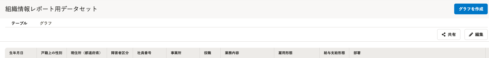 | 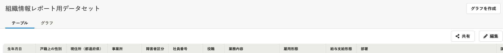 |

ダイアログのタイトルを変更しました。
また、テキスト入力欄内に表示していたプレースホルダー（「テキストの入力をしてください」の文字）をテキスト入力欄の上に移動させ、文言を修正しました。

| **変更前** | **変更後** |
| --- | --- |
| 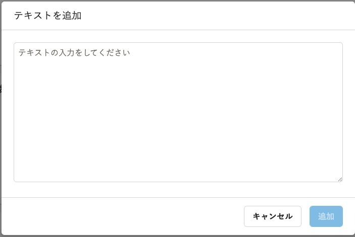 | 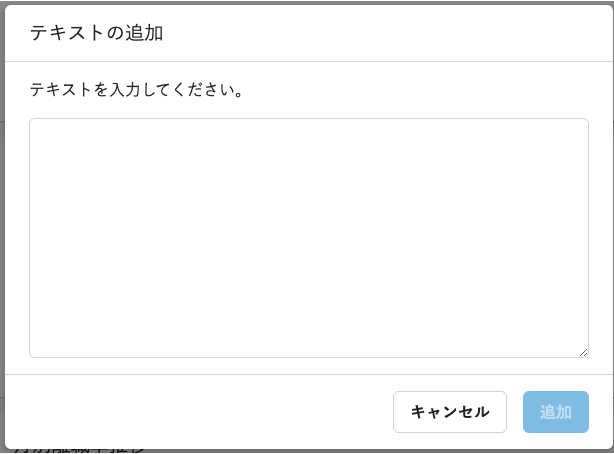 |

:::related
[複数の操作をまとめるボタン | デザインパターン（共通） | SmartHR Design System](https://smarthr.design/products/design-patterns/dropdown-button/)
[共通設定 | デザインパターン（基本機能） | SmartHR Design System](https://smarthr.design/products/design-patterns-core-features/main-admin/#h4-6)
:::

