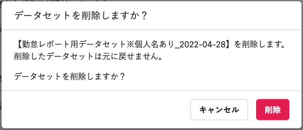
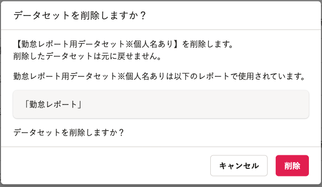

2022年5月17日（火）に行なったアップデートの詳細をお知らせします。

分析レポートの変更点は、改善1件でした。

# 📈改善

## データセット削除時の確認ダイアログに、そのデータセットに紐づくレポート名を表示するようにしました

これまではデータセットを削除するときに、そのデータセットのグラフがレポートで使われているかどうか確認できませんでした。
そのため、レポートで使用しているデータセットをうっかり削除してしまい、レポート内のグラフが見えなくなってしまうことがありました。

今回のリリースにより、データセット削除時の確認ダイアログにそのデータセットに紐づくレポート名を表示するようにしました。
レポートで使用中のデータセットかどうかがわかりやすくなり、必要なデータセットを誤って削除してしまうことを防ぎます。

| **変更前** | **変更後** |
| --- | --- |
|  |  |
