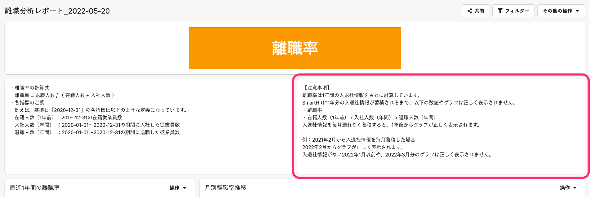

2022年5月23日（月）、24日（火）に行なったアップデートの詳細をお知らせします。

分析レポートの変更点は、改善1件・不具合修正1件でした。

# 📈改善
## プリセットレポートの「離職分析レポート」に注意事項を記載したテキストウィジェットを追加しました

「離職分析レポート」で確認できる離職率の数値やグラフは、SmartHRに1年分の入退社情報が蓄積されていないと正しく表示されません。
それらの注意事項を記載したテキストウィジェットを「離職分析レポート」に追加し、離職率の数値やグラフが正しく表示されていない場合に参照できるようにしました。

※この変更は新しく作成したプリセットレポートに適用されます。作成済みのプリセットレポートには反映されません。

| **変更前** | **変更後** |
| --- | --- |
|  |  |

# 👨‍⚕不具合修正

初回のデータの同期に関する1件の不具合を修正しました。

