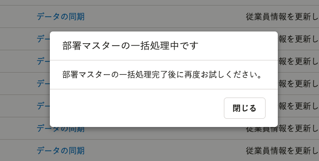

2022年6月7日（火）に行なったアップデートの詳細をお知らせします。

分析レポートの変更点は、改善2件でした。

# 📈改善
## データの同期開始後に追加・変更・削除されたデータは同期しないようにしました

分析レポートでデータの同期実行中にSmartHR基本機能で追加・変更・削除があった場合、一部データのみが同期対象に含まれ、同期されることがあります。
今回、同期を開始した時刻以降に、SmartHR基本機能で追加・更新・削除された従業員情報は、同期しないようにしました。

なお、同期開始後の「給与明細情報」の追加・更新・削除については、今後対応予定です。

## SmartHR基本機能で部署マスターに関わる一括処理実行中は、データを同期できないようにしました

これまで、SmartHR基本機能で部署マスターに関わる一括処理実行中に、分析レポートでデータの同期を実行できたため、一括処理中の一部データのみが分析レポートに同期されることがありました。
今回、一部データのみが同期されることを防ぐため、SmartHR基本機能で部署マスターに関わる一括処理実行中は、分析レポートでデータの同期ができないように変更しました。

SmartHR基本機能で一括処理実行中に[データを同期]を押すと、警告メッセージが表示されます。
警告メッセージが表示された場合は、SmartHR基本機能の一括処理が完了するまでお待ちください。

### 実行中に分析レポートでデータを同期できないSmartHR基本機能の一括処理
- 部署マスター
  - 部署を一括追加（CSV）
  - 部署を一括更新（CSV）
  - 部署履歴を一括追加・更新（CSV）
- 予約管理
  - 部署マスターを追加・更新 

