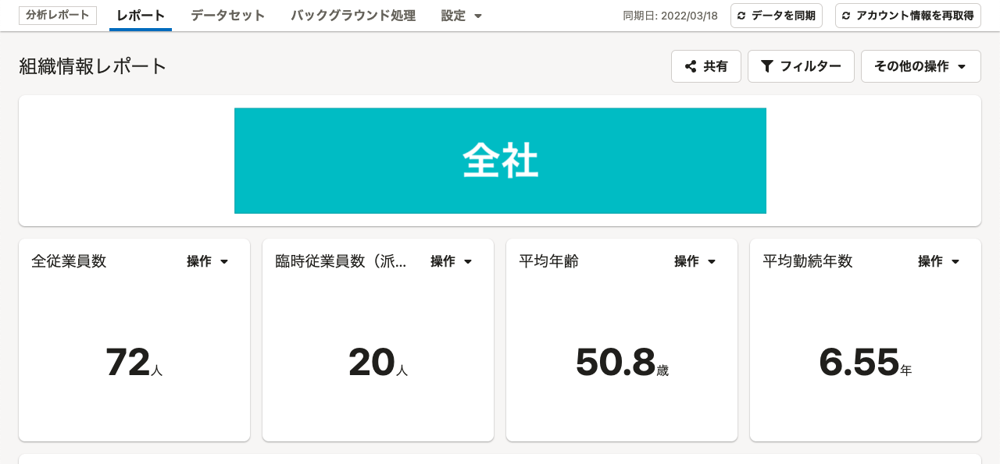
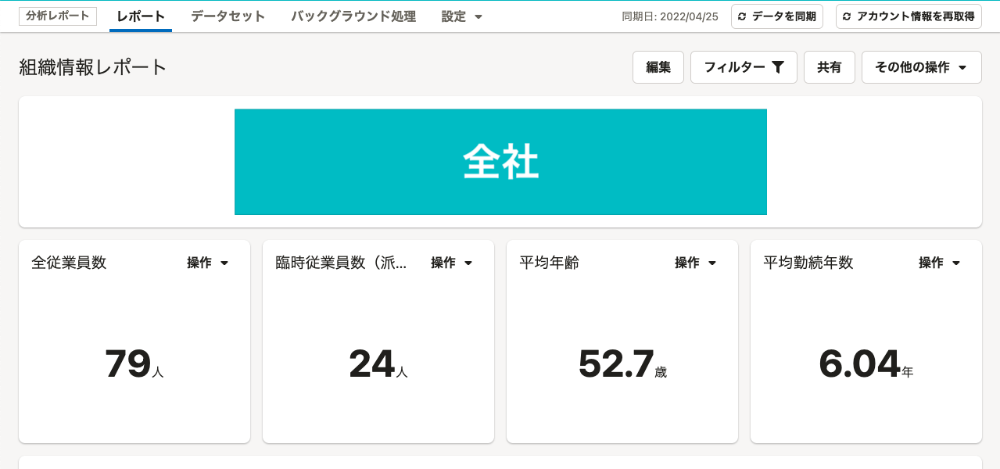
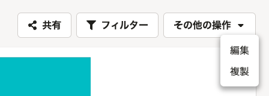
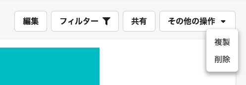
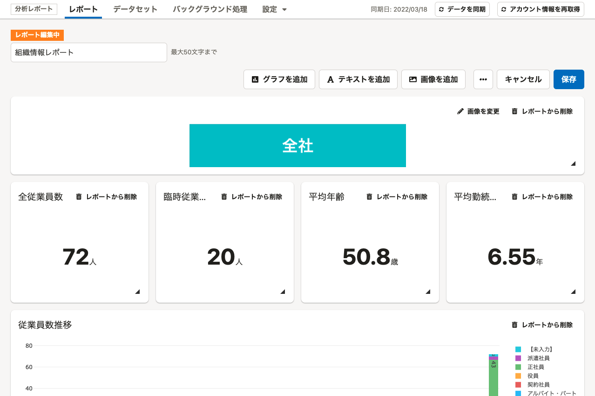
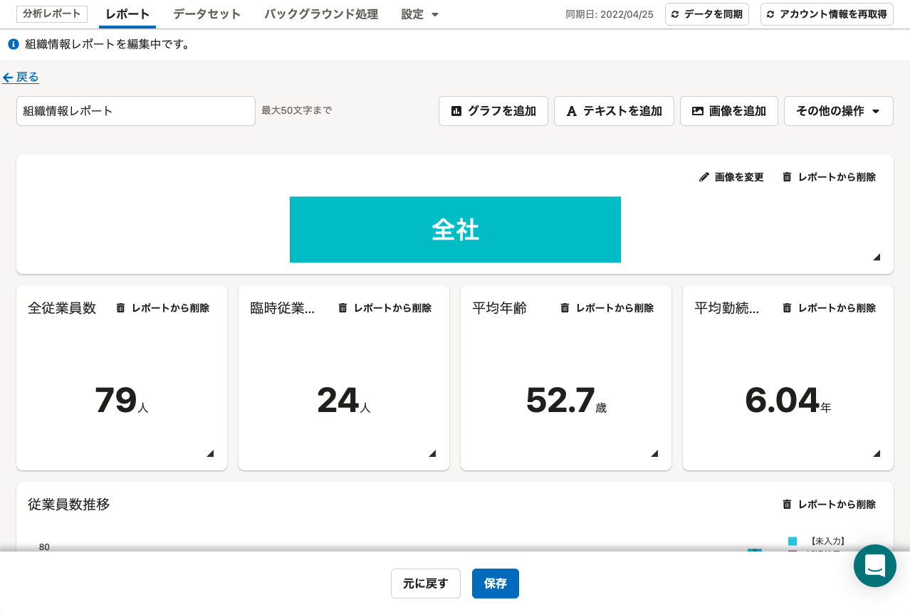

2022年6月20日（月）に行なったアップデートの詳細をお知らせします。

分析レポートの変更点は、改善1件でした。

# 📈改善

## レポートの詳細画面と編集画面の操作メニューを変更しました

レポートの詳細画面および編集画面にて、それぞれ下記の変更をしました。

### レポート詳細画面

［編集］ボタンを追加し、［その他の操作］ボタンを経由せずに、レポートを編集できるようにしました。

また、［その他の操作］ボタンから、レポートを削除できるようにしました。

| 変更前 | 変更後 |
| --- | --- |
|  |  |
|  |  |

### レポート編集画面

［元に戻す］ボタンを追加し、編集前の状態に戻せるようにしました。
［保存］ボタンとあわせて、画面下部から操作できます。

また、［キャンセル］ボタンを廃止しました。
今後は画面左上の［戻る］をクリックすると、レポートの詳細画面に戻れます。

そのほか、ドロップダウンリストの文言を［その他の操作］にするなどの変更をしました。

| 変更前 | 変更後 |
| --- | --- |
|  |  |
