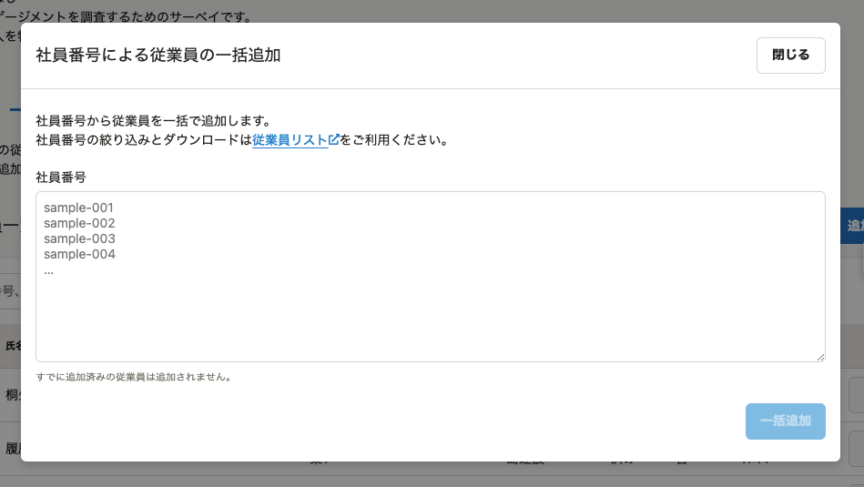

2021年4月20日（火）に行なったアップデートの詳細をお知らせします。

従業員サーベイ機能の変更点は、新機能1件でした。

# ✨新機能

## 対象従業員を社員番号で一括追加できるようにしました

 **［対象従業員］** 画面の **［**  **︙］** メニューから、対象従業員を社員番号で一括追加できるようにしました。

これまでは、サーベイの対象従業員の絞り込みには、部署や役職、在籍状況などの限られた従業員情報しか使用できず、複雑な条件で対象従業員を絞り込みできませんでした。

今回のリリースにより、SmartHR基本機能の「従業員リスト」からダウンロードしたExcelファイルやCSVファイルの社員番号をコピーアンドペーストすれば、複雑な条件でも対象従業員を追加できるようになります。

:::related
[フィルタ機能を使って、条件に合致する従業員リストを表示させる](https://knowledge.smarthr.jp/hc/ja/articles/360040965373)
[従業員情報、家族情報の登録データをダウンロードする](https://knowledge.smarthr.jp/hc/ja/articles/360026106394)
:::
