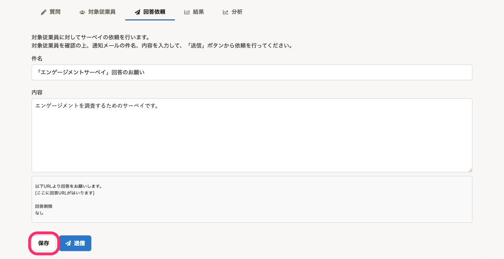

2021年4月21日（水）〜28日（水）に行なったアップデートの詳細をお知らせします。

従業員サーベイの変更点は、新機能1件・不具合修正1件でした。

# ✨ 新機能

## サーベイ回答依頼時に送信するメールの件名と内容を、送信前に保存できるようにしました

これまでは、件名と内容を保存するには、回答依頼を送信する必要がありました。

今回のリリースにより、 **［保存］** をクリックすることで、メールの送信前にも件名と内容を保存できるようにしました。

# 👨‍⚕️ 不具合修正

スコアの再計算に関する1件の不具合修正を行ないました。
