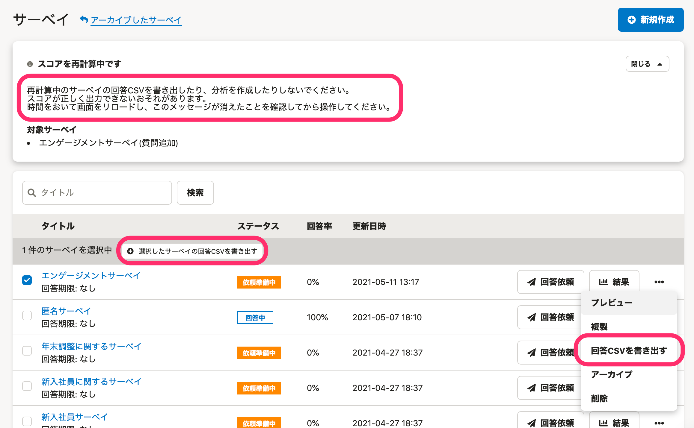
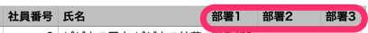
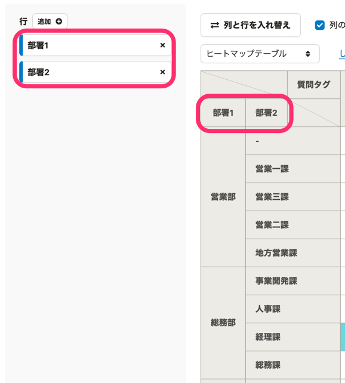
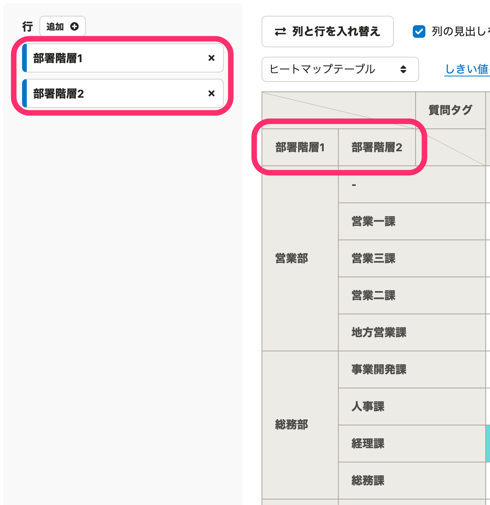

2021年5月13日（水）〜19日（木）に行なったアップデートの詳細をお知らせします。

従業員サーベイの変更点は、カイゼン2件でした。

# 📈 カイゼン

## 「エクスポート」の表記を「書き出す（書き出し）」に変更しました

全体的に **「エクスポート」** の表記を **「書き出す（書き出し）」** に変更しました。

SmartHR全体での表記ルールに合わせた対応です。

## 部署の階層構造の文言を［部署階層1］、［部署階層2］に変更しました

これまでは、部署の階層構造を示すときに **［部署1］** 、 **［部署2］** という文言が使われていましたが、SmartHR基本機能で兼務先の意味で使われている **［部署1］** 、 **［部署2］** と表記が同じため、わかりづらいものでした。

そのため、今回の改修で **［部署階層1］** 、 **［部署階層2］** という文言に変更しました。

変更箇所は下記のとおりです。

- 回答CSVファイルのヘッダー

| 変更前 |  |
| --- | --- |
| 変更後 |  |

- 分析画面

| 変更前 |  |
| --- | --- |
| 変更後 |  |
